- [[周报]]
	- [[本周完成]]
		- **中移mobile-data数据集**: 尝试先用一个公式对qoe进行建模, 并尽可能使模型最终输出的qoe的分布接近我们的目标分布(均匀/正态)
			- ***思路一: 能用log皆用log***
				- **formulaization**
					- $QoE = \alpha_1log(aTR)-\alpha_2log(sAT)-\alpha_3log(fBT)-\alpha_4log(sAC)+\alpha_5wSS+\beta$
						- ==共选取了数据集中的5个指标进行建模: aTR为avgTimeRemain, sAT为stutterAllTime, fBT为firstBufferTime, sAC为stutterAllCnt, wSS为wirelessSignalStrength== (之所以删掉了一些指标, 主要是为了减少网格搜索调最优超参所花费的时间)
					- $\vec{\alpha}_{opt} = arg\ \mathop{min}\limits_{\vec{\alpha}}\ KLD(\ dist(uniform),dist(QoE(\vec{\alpha})))$
					- $s.t. \ \ (1)\ \alpha_i>0 ,\ \forall\ 1\leqslant i \leqslant n\ (2) \sum\limits_{i=1}^{n}\alpha_i = 1$
					- 对每个指标取log后, 实际上还会进行times次的"正态化+激活函数"的处理, 目的是让每个指标都分布得尽量均匀, 以减少最终的qoe的分布和均匀分布相比的KLD. "正态化+激活函数"的运算没有体现在公式中.
				- ~~基本思路~~
				  collapsed:: true
					- 使各个指标的分布尽可能接近均匀分布 (以下第2, 3步可多次迭代)
						- log
						- 标准正态
						- 激活函数
						- 归一化
					- 使最终qoe, 即各指标加权和的分布尽可能接近均匀分布
				- ~~两个优化 (使用scipy.optimize) (分别对应基本思路中的两步)~~
				  collapsed:: true
					- 优化正态化时的\mu和\sigma, 使每个指标的分布尽可能接近均匀分布
					- 优化各个指标的加权权重, 使最终qoe的分布尽可能接近均匀分布
						- 这个优化可以根据给指标的相关性添加约束, 目前添加的约束为所有系数都在[0.1, 1]或[-1, -0.1]之间(根据相关性的正负来调整), 且绝对值的大小关系和相关性一致
				- ~~存在的问题~~
				  collapsed:: true
					- 想得太理想化了, 实际取得的效果并不好; 以下是一些指标经过多次的"正态+激活"迭代后的分布, 可以明显看出我们正态化时的\mu和\sigma需要得到优化.
					  collapsed:: true
						- 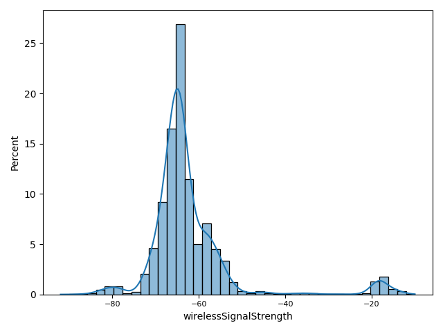
						- 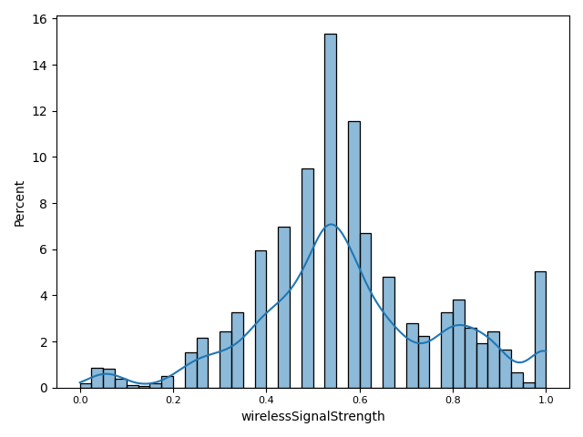
						- 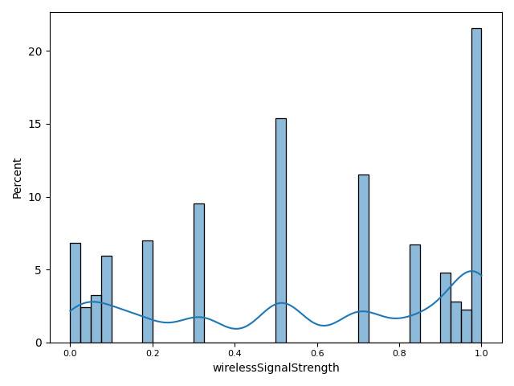
						-
						- 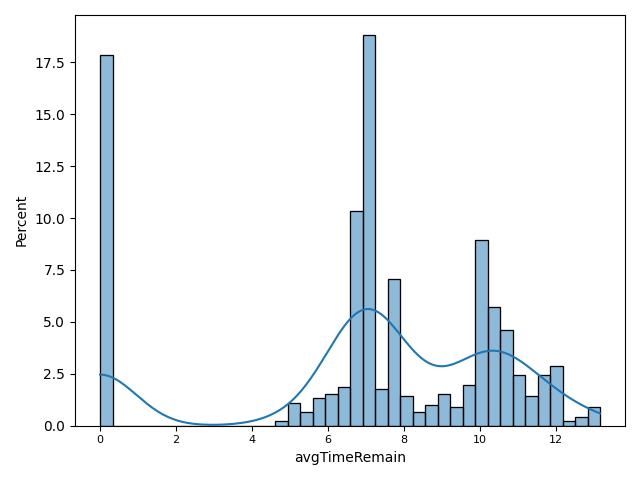
						- 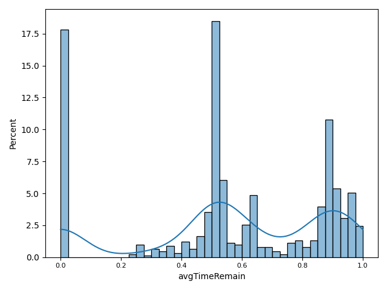
						- 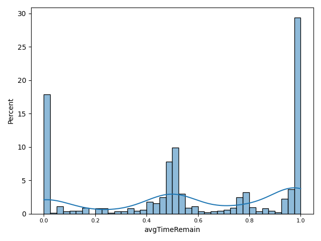
						- 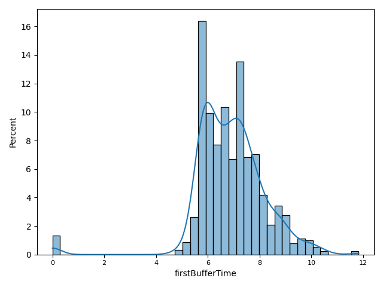
						- 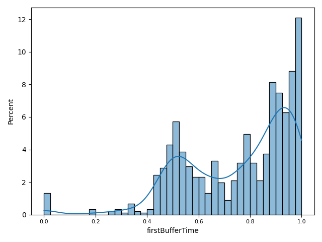
						- 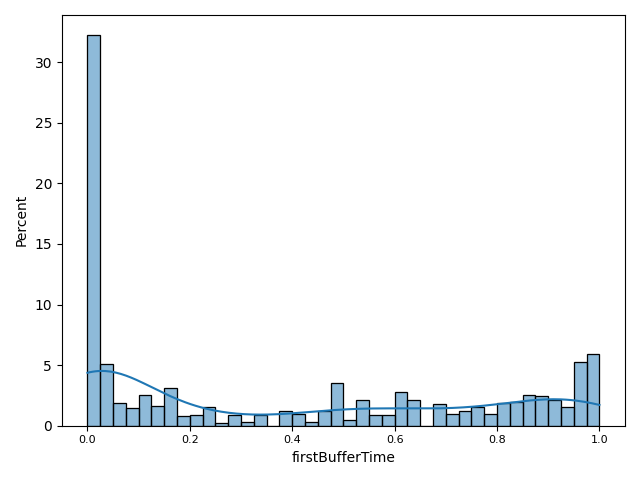
						-
					- 本来希望通过scipy.optimize求得最优的\mu和\sigma, 以及各指标的权重, 但是效果很差, 甚至出现优化还不如不优化的情况
					  collapsed:: true
						- 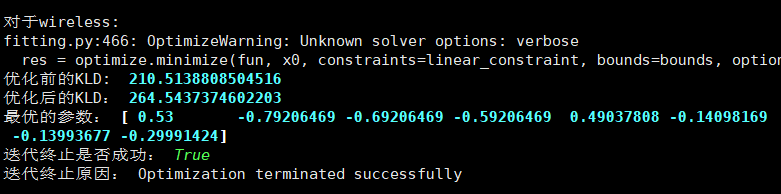
					- 最终的qoe分布可视化出来以后, 直观上并不像均匀分布, 反而更接近正态分布
					- 就算qoe模型的输出的分布是一个均匀/正态分布, 但依然无法说明我们模型能够准确反映QoE.  比如我们的qoe模型可能是将一些本来在中间稠密部分的值拉到很高或很低.
				- **现阶段效果**
					- 与均匀分布的KLD (表格中的次数为"正态化+激活函数"的迭代次数)
						- |类型|mos (不靠谱)|0次|1次|2次|3次|
						  |--|--|--|--|--|--|
						  |wireless|inf|552.2673|**139.5836**|186.2829|212.2648|
						  |wired|624.7248|188.8539|**51.0745**|51.0919|241.7248|
					- 可以看出, 对指标进行一次"正态化+激活函数"的处理, 最终的KLD可以达到最小
					- 下面是在wired场景下, 原数据集中'mos'这一指标的分布直方图和我们计算出的qoe的分布图, 可以明显看出我们的qoe的分布更加均匀
						- 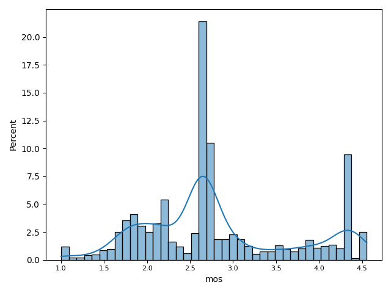
						- 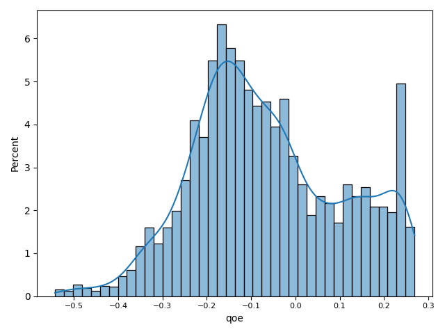
				- **一些说明**
					- 求解最优化问题的方法:
						- 目前采用网格搜索, 来求解使KLD最小的参数.
						- 网格搜索一个最大的问题就是时间复杂度太高, 例如, 我目前只使用5个指标, 每个指标的系数只有5种取值可选, 最终会有3091种系数组合, 需要1小时48分钟才能取得最优参数. 如果使用完整的8个指标, 每个指标的系数有10种取值, 那最终会有390367种系数组合, 需要7.86天才能跑完
						- 目前有一个想法, 可以很大程度上减少搜索空间, 那就是不再给每个指标都分配一个超参, 这太奢侈了, 我们可以给每个簇定义一个"簇指标", 然后给每个簇指标都分配一个超参. 这个想法是下面思路2的雏形; 但每个簇指标具体应该如何定义是亟待解决的问题, 需要参考一些已有结论.
						- 也尝试过使用scipy.optimize中提供的各种方法来调超参, 但效果很差
				- **一些问题**
					- "正态化+激活函数"使最终的KLD减小了, 但这样的做法缺乏理论支撑, 之后可以在留意一下有没有相关文献用到此类方法.
			- ==***思路二: 参考已有论文建模***==
				- 思路二的建模主要参考P.1203-1和P.1203-3, 同时结合目前的mobile-data数据集的具体情况 (P.1203所需要的部分指标我们的数据集中没有, 所以需要对原模型作适当修改)
				- **formulaization**
					- $QoE = \alpha_1 \times MI(mR, fr, res) + \alpha_2 \times SI(sAT, sAC)$
						- P.1203模型的输入参数只有两类: 一类是media, 用来反映媒体本身的质量; 另一类是buffer, 用来反映卡顿情况.  {{cloze 仔细一想这不无道理, 因为观众无非就是关注两个方面: 视频本身的质量(清晰度和流畅度; 对应media), 以及看的时候卡不卡(对应stutter) .}} 受其启发, 这里我们只定义两个indicator, 一个是**MI**(media indicator), 另一个是**SI**(stutter indicator). 我们调超参时只需要调$\alpha_1$和$\alpha_2$两个超参即可
						- ==其中, MI通过数据集中的['mediaRate', 'framerate', 'resolution']计算而得; SI通过数据集中的['stutterAllTime', 'stutterAllCnt']计算而得;==
						- SI的公式较简单, 通过指数函数建模, 如下图:
							- 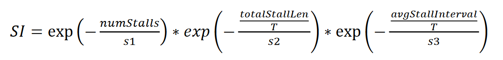
						- MI的计算参考P.1203-1的8.1, 计算较复杂, 既用到了指数函数又用到了对数函数. 两个指标具体计算的实现函数见: ((af74c9c9-52aa-4d2c-a49e-617a45ff1a7b))
					- 优化目标和约束条件同思路1:
						- $\vec{\alpha}_{opt} = arg\ \mathop{min}\limits_{\vec{\alpha}}\ KLD(dist(QoE(\vec{\alpha})),\ dist(uniform))$
						- $s.t. \ \ (1)\ \forall\ 1\leqslant i \leqslant n, \alpha_i>0 \ \ (2) \sum\limits_{i=1}^{n}\alpha_i = 1$
				- **MI和SI的具体计算方式** (参考P.1203)
				  id:: af74c9c9-52aa-4d2c-a49e-617a45ff1a7b
					- ```python
					  def get_MI2(br, fr, disRes, codRes=0):  # 第二种方法舍弃了原公式中多处对范围的限定
					      def RfromMOS(mos):
					          return (mos-1)/4*100
					      def MOSfromR(r):
					          return 1 + 4 * r/100
					      fr = 1 if fr < 1 else fr  # 使我们的模型可以处理fr<1时的情况
					      codRes = disRes if codRes == 0 else codRes  # TODO: 数据集中没有可用的codRes, 故只能出此下策
					      bpp = br / (codRes * fr)
					      a1, a2, a3, a4 = 11.99835, -2.99992, 41.24751, 0.13183
					      quant = a1 + a2 * np.log( a3 + np.log(br+1e-5) + np.log(br * bpp + a4) )  # 使我们的模型可以处理br==0时的情况
					      q1, q2, q3 = 4.66, -0.07, 4.06
					      MOSq = q1 + q2 * np.exp(q3*quant)
					      # MOSq = max(min(MOSq, 5), 1)
					      Dq = 100 - RfromMOS(MOSq)
					      # Dq = max(min(Dq, 100) , 0)
					  
					      scaleFactor = max(disRes/codRes, 1)
					      u1, u2 = 72.61, 0.32
					      Du = u1 * np.log10(u2 * (scaleFactor - 1) + 1)
					      # Du = max(min(Du, 100) , 0)
					  
					      t1, t2, t3 = 30.98, 1.29, 64.65
					      Dt1 = 100 * (t1 - t2 * fr) / (t3 + fr)
					      Dt2 = Dq * (t1 - t2 * fr) / (t3 + fr)
					      Dt3 = Du * (t1 - t2 * fr) / (t3 + fr)
					      Dt = Dt1 - Dt2 -Dt3 if fr < 24 else 0
					      # Dt = max(min(Dt, 100) , 0)
					  
					      Qmax = 100 - Du - Dt1 if fr < 24 else 100 - Du
					      Q = 100 - (((100 - Qmax ) + Dq - Dt2 - Dt3)) if fr < 24 else 100 - (((100 - Qmax ) + Dq))
					      MOS = MOSfromR(Q)
					      # if deviceType == "handheld":  # TODO: 数据集中无法识别当前设备是否为手持设备;
					      #     htv1, htv2, htv3, htv4 = -0.60293, 2.12382, -0.36936, 0.03409
					      #     MOS = htv1 + htv2 * MOS ̂+ htv3 * MOS**2 + htv4 * MOS**3 
					      #     MOS ̂= max(min(MOS, 5), 1)
					      return MOS
					  
					  
					  def get_SI2(numStalls, totalStallLen, avgStallInterval=0, T=60):  # 改进版
					      if avgStallInterval == 0:
					          avgStallInterval = (T-totalStallLen) / (numStalls+1)
					      s1, s2, s3 = 9.35158684, 0.91890815, 11.0567558
					      return np.exp (-numStalls/s1) * np.exp (-totalStallLen/T/s2 ) * np.exp (-avgStallInterval/T/s3 )
					  ```
				- **一些说明**
					- 在计算MI和SI时, 一方面, 各种系数都是从P.1203中照搬过来的, 因此可能并不适合我们的数据集; 另一方面, 对于那些我们数据集中没有但是模型又需要的指标 (如codRes, avgStallInterval等), 我们只能传入一个估计值.
				- **一些问题**
					- ==MI和SI都呈现严重的长尾分布, 最终算出的KLD达到了inf==.  产生这种问题可能有以下几种原因:
						- (1) 这或许是因为我们数据集中的很多指标本身就有严重的长尾分布问题; 不知道在之后的完整数据集上会不会有好转;
						- (2) P.1203并不适合于我们的数据集, 所以还要去尝试其他已有的, 较权威的, 更适合我们的业务场景的模型;
						- (3) 不排除目前我的编程存在不小心写错的地方, 导致了最终的结果不理想.
					- 下面是MI, SI, 和qoe的分布图:
						- 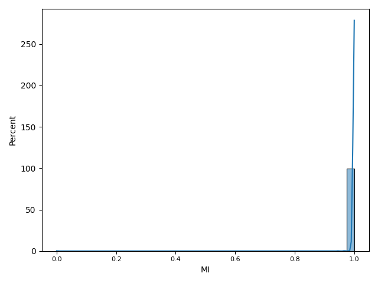
						- 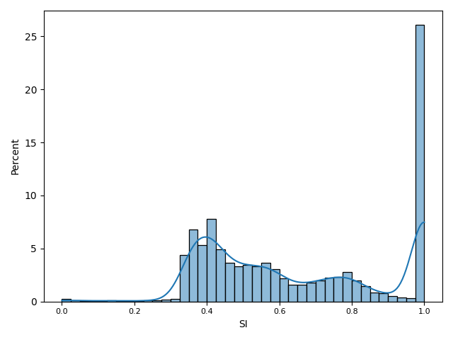
						- 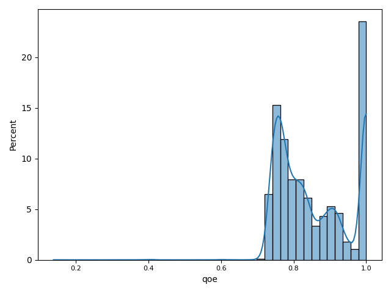
					- 关于指标:
						- P.1203中, 编码分辨率(codRes)和显示分辨率(disRes)是评价视频质量的两个重要指标, 目前数据集中的resolution似乎表示disRes, 但codRes无法获得. 或许数据集中的displayResolution是codRes? 但是displayResolution不是个好指标, 因为有很大比例的上报都会缺失该指标.
						- P.1203中, 需要判断用户设备的类型是否为手持设备; 我们的数据集中有一个screenSize倒是可以用来判断(<=7为手持), 但这个指标只在30%的上报中有值
						- P.1203中, 计算反映卡顿的SI时, 需要avgStallInterval, 即平均的卡顿间隔, 这在我们的数据集中没有直接给出. ==最好是能获取到到每个卡顿事件的数据集==, 这样才能比较方便地建模. 目前数据集中已有的stutterList似乎可以将stutter事件重新复原出来, 但经过尝试后发现很多stutterList无法连接起来
	- [[下周计划]]
		- **继续对模型进行完善**
			- 参考除p.1203以外的其他论文?
		- **撰写数据分析及建模报告**
		- **newsletter**