- [[周报]]
	- [[本周完成]]
		- **家宽qoe的公式建模**
			- 现阶段成果基本整理到ppt中
			- 考虑用户区分度的问题
				- 根据模型输出的qoe值, 将用户做一个划分, 比如0.0~0.2划分成一个用户群, 0.2~0.4划分成一个用户群, ... 这样. 然后研究各个用户群之间, 各项指标有什么差异; 主要是看看哪些指标对用户的qoe影响最大之类的
				- **箱型图**
					- **同一qoe下的不同指标** (图片顺序为qoe=0, 1, 2, 3, 4)
						- **wireless**
							- 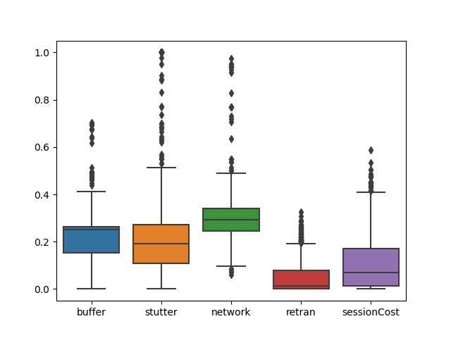
							- 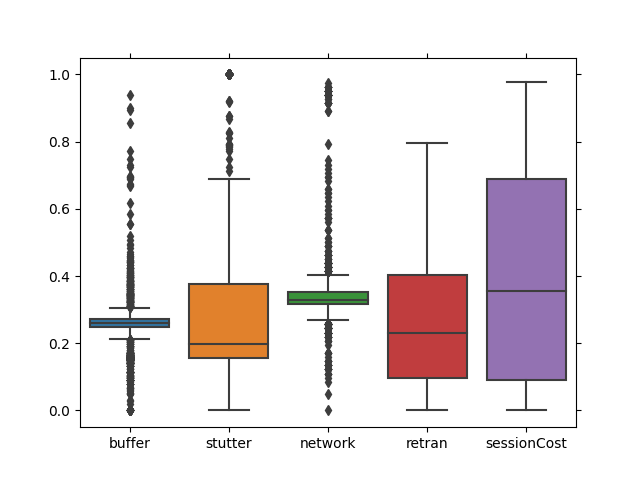
							- 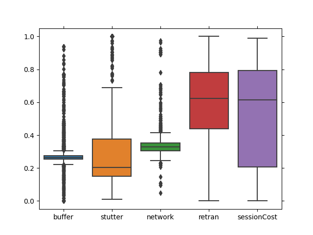
							- 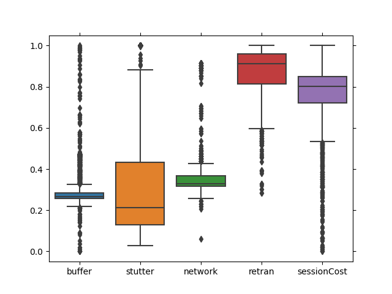
							- 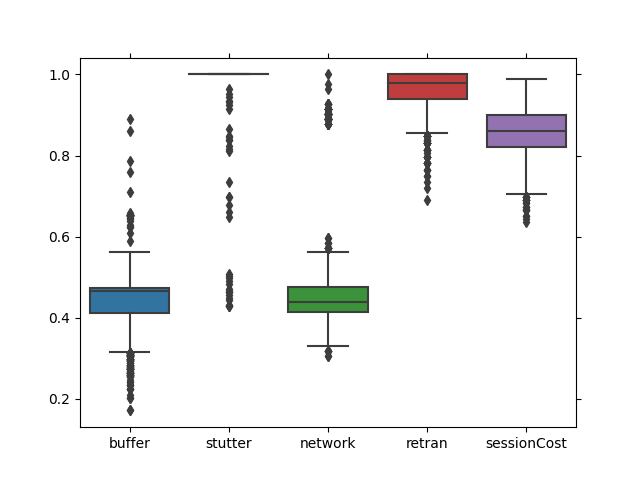
						- **wired**
							- 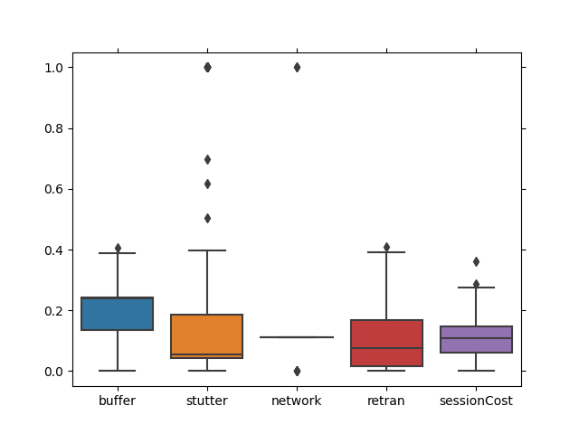
							- 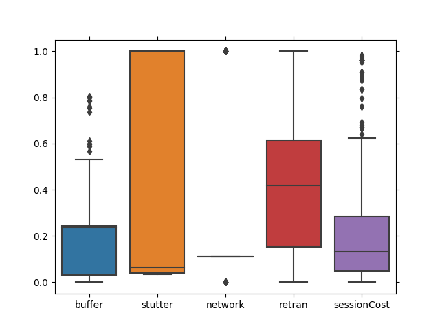
							- 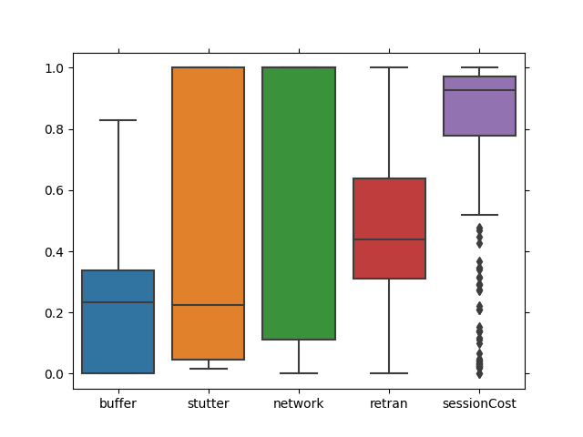
							- 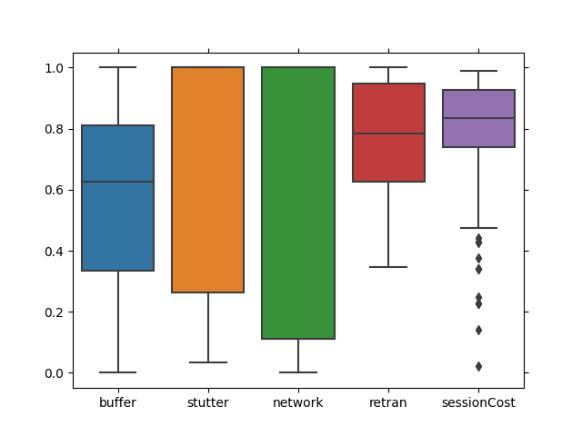
							- 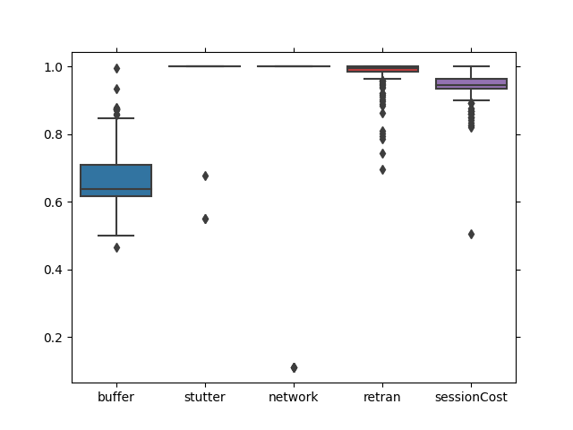
					- 同一指标在不同qoe下
						- **wireless**
							- 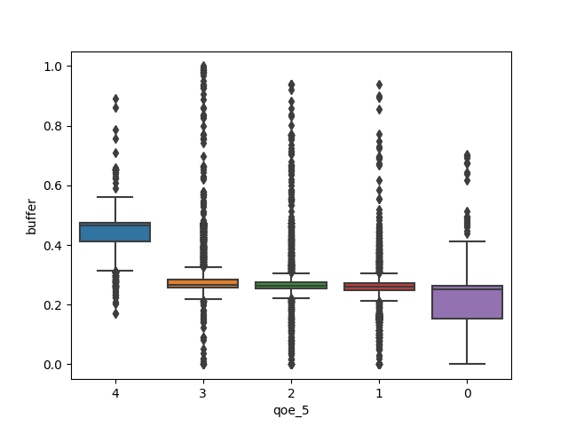
							- 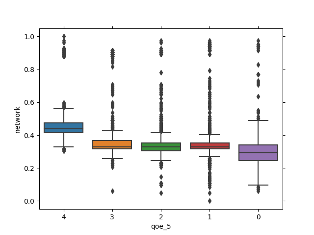
							  :LOGBOOK:
							  CLOCK: [2022-11-06 Sun 21:37:01]
							  :END:
							- 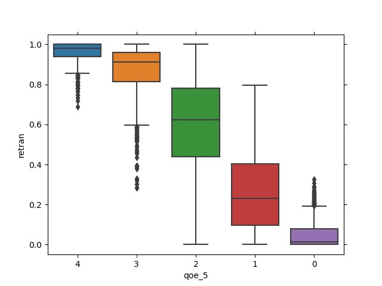
							- 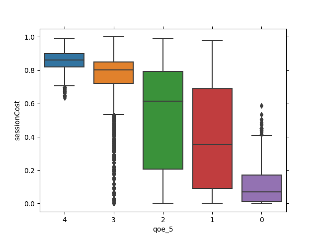
							- 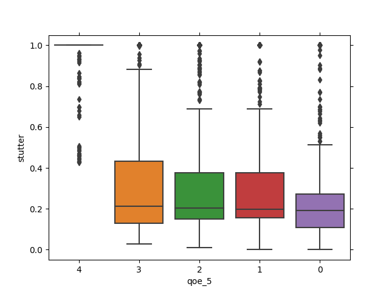
						- **wired**
							- 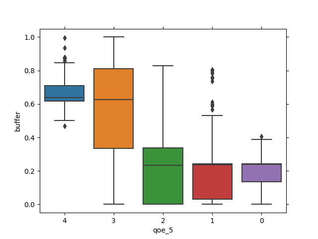
							- 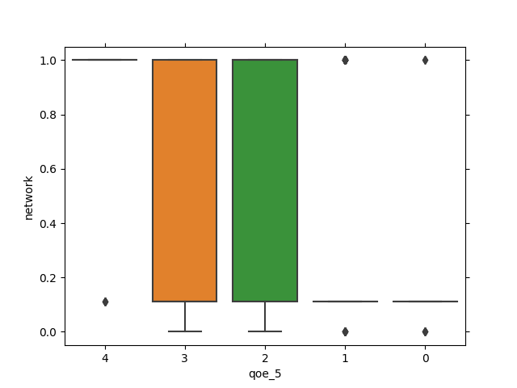
							- 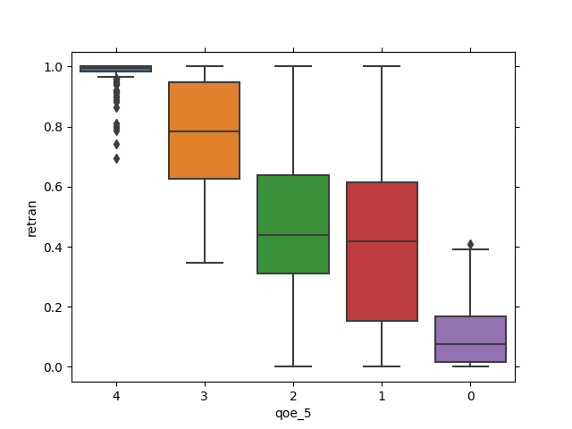
							- 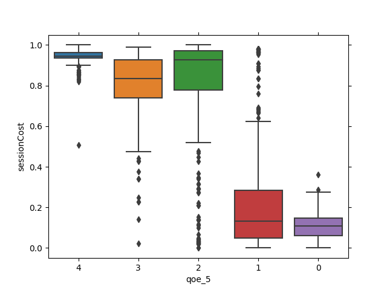
							- 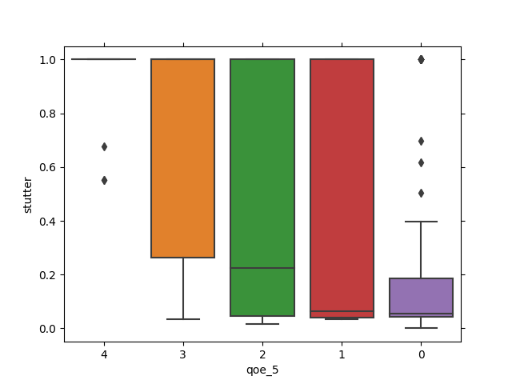
	- [[下周计划]]
		- **对家宽qoe的神经网络建模**
			- 无监督的分类模型; 具体来说是指标分类. 即对关键指标的二分分类
			- 目的是, 对于我们QoE比较低的用户, 再具体看哪些具体的指标; 也就是去找到, 通过改善哪些指标, 可以使用户的qoe得到改善
			- 就是和之前公式建模的思路反过来了; 之前是通过指标计算qoe, 现在是反过来, 对哪些低的qoe进行一个分析, 分析出是什么指标导致了低的qoe, 从而对qoe进行改善和优化