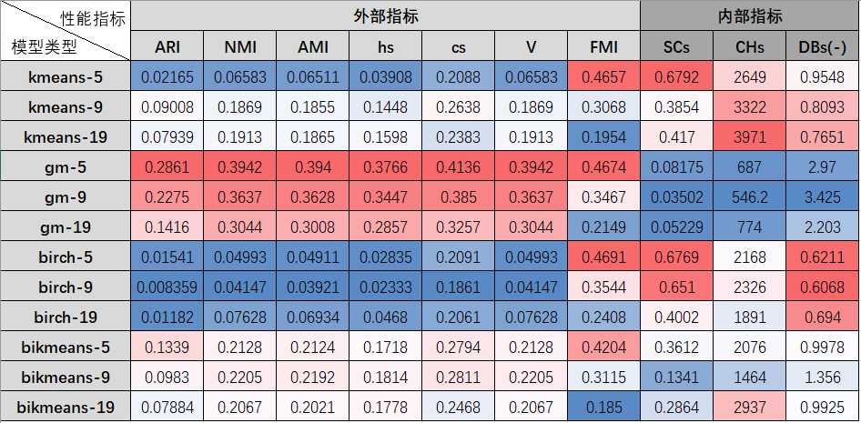
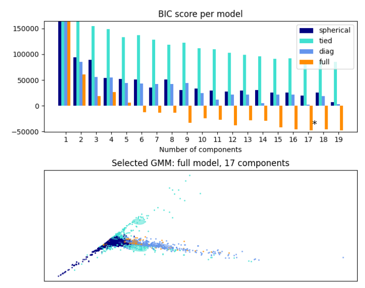
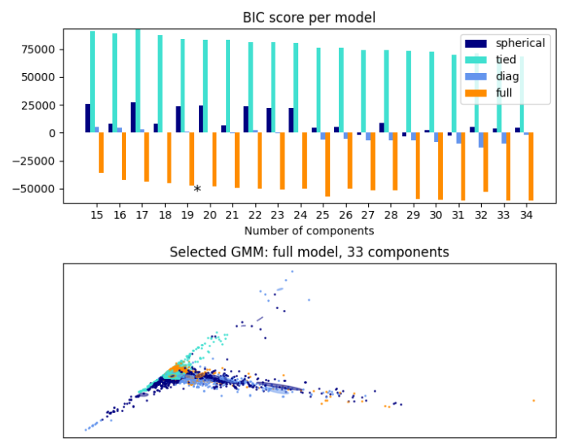
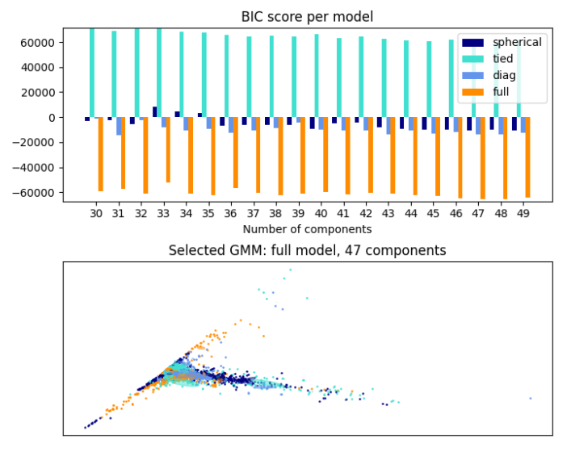
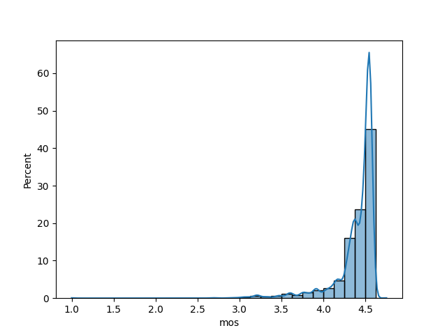
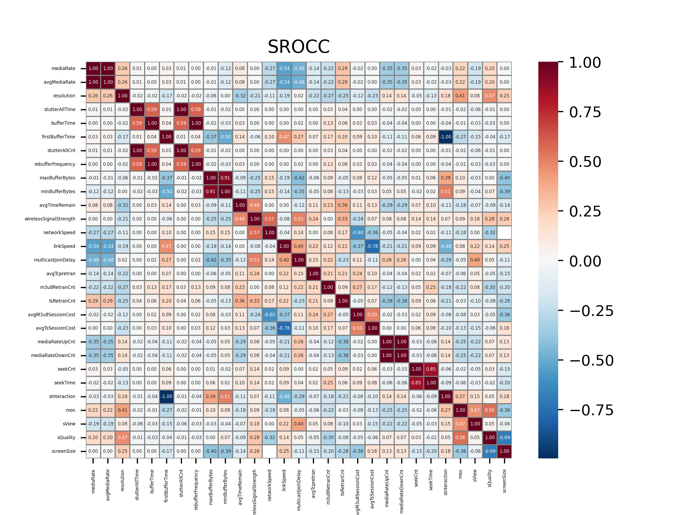
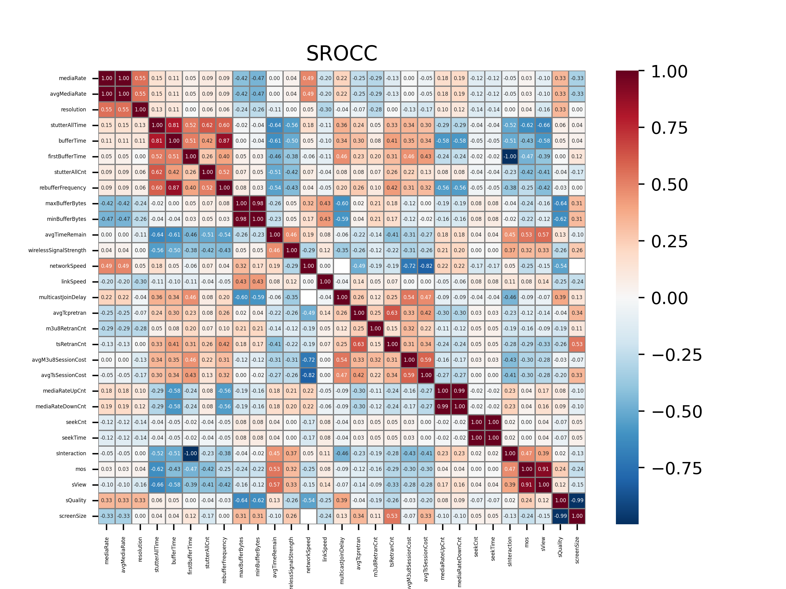

- [[周报]]
	- [[本周完成]]
		- ## 使用==无监督学习==的方法, 对mobile-data数据集进行==降维==和==聚类==
			- ### 降维
				- 尝试了"主成分分析"和"因子分析"两种降维方法. 其中主成分分析取得的效果是:
					- 对较为完整的**24**个指标进行降维, 可以降到成**9**维
					- 对fitting建模时筛选出的**8**个指标进行降维, 可以降到**5**维
			- ### 聚类
				- 尝试了常见的聚类算法: **KMeans++**, **GaussianMixture**(高斯混合模型), **BIRCH**(综合层次聚类算法), **BisectingKMeans** (二分KMeans)
				- **性能测试**
					- 
					- ==**表格说明**==
						- 越红表示性能越好, 越蓝表示性能越差
						- 前7个性能指标为**外部指标**, 需要给出labels_true, ==主要衡量聚类模型预测的labels_pred和labels的相似性==; 这里的labels_true使用了之前公式建模输出的qoe值
						- 后3个性能指标为**内部指标**, 不需要给出labels_true, ==主要衡量聚类内部数据点的紧凑程度, 以及聚类之间的数据点的分离程度==
						- `kmeans-9` 中的9是指聚类的数量
				- **结果分析**
					- 从外部指标来看, GaussianMixture有碾压性的优势, 且将数据聚为5类时效果最好, 这说明==高斯混合模型输出的聚类结果最接近我们之前建模公式的输出==
					- 但GaussianMixture的内部指标性能惨不忍睹; 这说明==高斯混合模型输出的各聚类: 聚类内部不够紧凑, 不同聚类之间也不够分离==. 先比之下, kmeans和birch的内部指标性能更为优秀
				- ==**问题**==
					- **簇数量的选择**
						- 在clusters数量的选择上, 不管使用gap statistics, 还是Gaussian Mixture Model中的BIC score, 都==倾向于选择尽可能多的簇==. ==这似乎在一定程度上说明聚类方法并不适合该问题.==
						- 下面的==图片==直观展示了使用BIC score选择cluster数量的过程, BIC score越低越好. 可以看到选择的clusters数量总是接近我们给出的上限.
							- **在1~20中选择cluster数量时:**
							  collapsed:: true
								- 
							- **在15~35中选择cluster数量时:**
							  collapsed:: true
								- 
							- **在30~50中选择cluster数量时:**
							  collapsed:: true
								- 
						- 正是因为簇数量的不确定性, 我在性能测试时, 同时测试了5, 9, 19三种簇数量下的模型性能, 但结果并不确定, 具体是簇多好还是簇少好, 随着具体的模型以及评价指标的变化而变化
		- ## 对最新给到的normal100数据集进行了==数据分析==
			- ### 单指标分布
				- normal100数据集是完整的数据集, 这导致各指标的分布情况, 相比于mobile-data数据集, 发生了以下变化: (这些变化是可以预见的)
				  collapsed:: true
					- (1) 指标的长尾分布状况都有或多或少的缓解 (比如占比从98%下降为91%), 但本质上大都还是长尾分布. 比如mediaRate, videoCodecType, frequency等;
					- (2) 但与此同时, 一些stutter, 重传, 时延等指标呈现出了更为严重的长尾分布, 它们甚至有99.9%以上的数据为0
				- 以下对一些分布变化明显的指标作重点说明
				  collapsed:: true
					- mediaRate这一指标的分布长尾性有所缓解, 之后在normal100数据集上建模时可以考虑它
					- videoType, 在卡顿数据集中, 直播占比80%, 但在完整数据集中, 直播占比42%, 这说明直播更容易发生卡顿
					- subEvent, 在卡顿数据集中, 62事件占比5%, 但在完整数据集中, 62占比20%, 这说明61和63事件更容易上报卡顿
					- accessMethod, 在卡顿数据集中, wifi占比80%, 但在完整数据集中, wifi占比13%, 这说明wifi比有线更容易卡顿
					- frequency, 在卡顿数据集中, 2.4G占比96%, 但在完整数据集中, 2.4G只占比30%, 这说明2.4G比5G更容易卡顿
				- ==**mos等各种评分指标也呈现出了更加严重的长尾分布, 下图是mos的分布图**==
					- 
			- ### 指标间的相关性
				- ==**指标间的相关性在normal100这个数据集上有所下降**==, 见下面两张图的比较
					- **normal100上的SROCC**
						- 
					- **mobile-data上的SROCC**
						- 
	- [[下周计划]]
		- 继续对各种聚类模型进行调参, 看能否有更好的性能; 另外也再尝试一些其它的聚类模型, 如ISODATA
		- 尝试除聚类外其他的方法? 弱监督? 自监督?
		- 继续在normal100数据集上把工作做完整, 包括用公式fitting出qoe, 以及尝试降维和聚类等