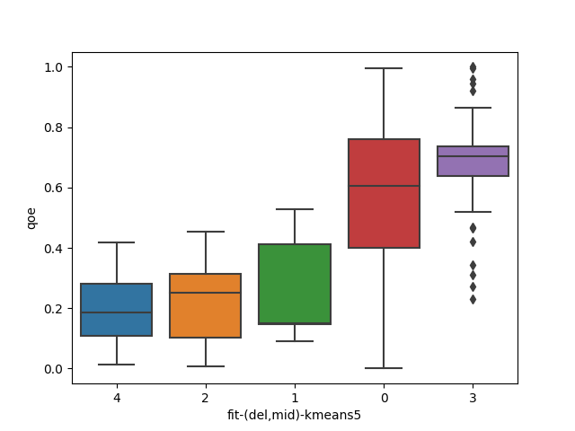
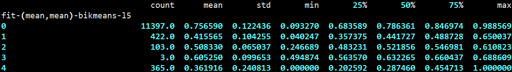
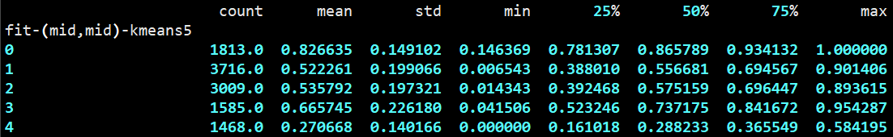

- [[周报]]
	- [[本周完成]]
		- ## fitting: 把fitting出的公式混用
			- ### 概述
				- 猜测: 在mobile-data上fitting出的qoe公式, 用在normal100数据集上, 低分qoe会占更大的比例. 但最终的结果与猜测不符.
			- ### 分布图
				- **将在mobile-data上fitting出的公式, 用在normal100数据集上**
					- 
				- **将在normal100上fitting的公式, 用在mobile-data数据集上**
					- 
		- ## unsupervised: 完善有关clustering的工作
			- ### version1 : 直接训练聚类模型
				- #### 概述
					- 对两个数据集均做以下工作:
						- 对聚类模型进行调参和筛选 (最终筛选出5个模型)
						- 探究聚类算法生成的各簇的qoe的统计指标 (均值、标准差等)
						- 箱线图
					- ==**模型命名方式**== (如 `['fit','del','mid','kmeans',5]` )
					  collapsed:: true
						- 前三个参数与PCA有关
						  collapsed:: true
							- 参数一: **all**: 对所有的23个指标作PCA;  **fit**: 对fitting时用到的8个指标作PCA
							- 参数二: PCA时, 对缺失值的处理方式: **del**为删除, **mid**为用中值替换, **mean**为用平均值替换
							- 参数三: PCA时, 对异常值的处理方式: **none**为不处理, **del**为删除, **mid**为用中值替换, **mean**为用平均值替换
							- > **注意**: 这里的对缺失值和异常值的处理方式, 是指==在做PCA时==的处理方式; 真正处理时, 对缺失值和异常值的处理方式是固定的: 缺失值删除, 异常值不处理
						- 后两个参数和聚类模型有关
						  collapsed:: true
							- 参数四: 模型类型
							  collapsed:: true
								- kmeans: K-Means (K-均值)
								- gm: Gaussian mixtures (高斯混合)
								- birch: BIRCH (综合层次聚类算法)
								- bikmeans-b: BisectingKMeans (二分K均值), 且超参`bisecting_strategy = 'biggest_inertia'`
								- bikmeans-l: BisectingKMeans (二分K均值), 且超参`bisecting_strategy = 'largest_cluster'`
							- 参数五: 聚类个数
				- #### mobile-data
					- 模型筛选
					  collapsed:: true
						- 
					- **统计指标**
						- **结果**
							- 
							- 
							- 
							- 
							- 
						- ==**分析**==
							- ==一个比较严重的共同问题是: **各簇的数据点个数相差过大** (比如有的簇只有十几个数据点, 而有的簇有上万个数据点); 这显然不是我们希望的. 为此, 我还尝试了ISODATA算法, 因为它可以将数据量过大的簇拆分, 将数据量过小的簇合并; 但尝试后发现ISODATA的各个性能指标都很差, 我通过网格搜索尝试了各种超参, 都未能使其性能得到改善.==
							- 但值得欣慰的是, ==**高斯混合算法(gm)**生成的各个聚类, 还算比较均匀.== 与此同时, 高斯混合聚类得出的各聚类均值的最大差值可以达到0.87-0.22=0.65, 也是所有尝试过的聚类算法中最好的
					- **箱线图**
					  collapsed:: true
						- 
						- 
						- 
						- 
						- 
				- #### normal100
					- 模型筛选
					  collapsed:: true
						- 
					- **统计指标**
						- **结果**
							- 
							- 
							- 
							- 
							- 
						- ==**分析**==
							- ==**在normal100数据集上, "簇大小相差过大" 这一问题变得更加突出**; 即便是高斯混合算法, 也生成了一个只含2个数据点的簇; 感觉这种就有些类似于影响我们聚类效果的异常点了.==
							- ==针对直接运行聚类算法后, 出现的簇大小差距过大的问题, 提出以下的解决思路; (该思路促使我进行了version2的尝试)==
								- **思路**
								  id:: 75f10afd-15dc-47f4-bf36-2bebdf8539e9
									- 运行一次聚类算法, 得到各簇;
									- 对于数据数量小于"数据总量5%"的那些簇, 直接将它们所包含的数据点从训练数据中删除, 然后再在剩余的数据上作聚类;
									- 不断迭代上述两过程, 直到所有簇的大小都不小于数据总量的5%
					- **箱线图**
					  collapsed:: true
						- 
						- 
						- 
						- 
						- 
			- ### version2 : 防止出现过小的cluster
				- #### 概述
					- 为解决聚类大小差距过大的问题, 实践了该思路:
						- {{embed ((75f10afd-15dc-47f4-bf36-2bebdf8539e9))}}
					- birch的性能很差, 而且在通过joblib.dump保存模型时会报错: `RecursionError: maximum recursion depth exceeded while calling a Python object`. 所以在version2中直接删除了该聚类算法
				- #### mobile-data
					- 模型筛选
					  collapsed:: true
						- 
					- **统计指标**
						- **结果**
							- 
							- 
							- 
							- 
						- **分析**
							- 在version2中, 所有的聚类算法都不会出现数据量过少的聚类了
							- 其中, **kmeans**的聚类较为==均匀==, 而且各个聚类的均值最大差值为0.82-0.27=0.55, 算比较大的了
							- 而**高斯模糊(gm)**的各个聚类没有那么均匀, 但gm的优势在于==均值最大差更大==: 0.87-0.23=0.64, 而且各聚类的==标准差整体上更小==. 从这些角度看, ==高斯模糊依然有着最好的聚类效果==. 这在箱线图中应该会有更直观的反映
					- **箱线图** (汇报中可只重点展示gm)
					  collapsed:: true
						- 
						- 
						- 
						- 
				- #### normal100
					- 模型筛选
					  collapsed:: true
						- 
					- **统计指标**
						- **结果**
							- 
							- 
							- 
							- 
						- **分析**
							- 在normal100这个数据集上, 各个聚类模型对低分qoe数据点的识别性能普遍下降.(这也与qoe本身就低分分布较少有关) 最终还是==**高斯模糊**这一聚类模型取得了最好的性能==. 依据是: 它得出了一个qoe均值最小的聚类; 它的聚类均值最大差值最大; 它的各聚类的标准差更小
					- **箱线图** (第2张和第4张效果较好)
					  collapsed:: true
						- 
						- 
						- 
						- 
			- #### 对version2所采用 ((75f10afd-15dc-47f4-bf36-2bebdf8539e9)) 的反思
				- 该思路起到的效果, 只是防止出现数据量过少的聚类, 并不以 "使各聚类的大小尽可能均匀" 为目标
				- ==对于normal100数据集, 如果直接运行聚类算法, 有的聚类只有几个或十几个数据点, 但其实这并不完全是一件坏事, 因为normal100数据集本身就是高分qoe数据占大多数, 所以说不定这十几个数据就是低qoe数据, 就是我们要重点改善的. version2相当于将这些数据直接忽略了. 因此, 感觉version2中的模型也好, version1中的模型也好, 它们没有孰好孰坏, 而是分别适用于不同的场景和需求==
	- [[下周计划]]
		- 撰写报告