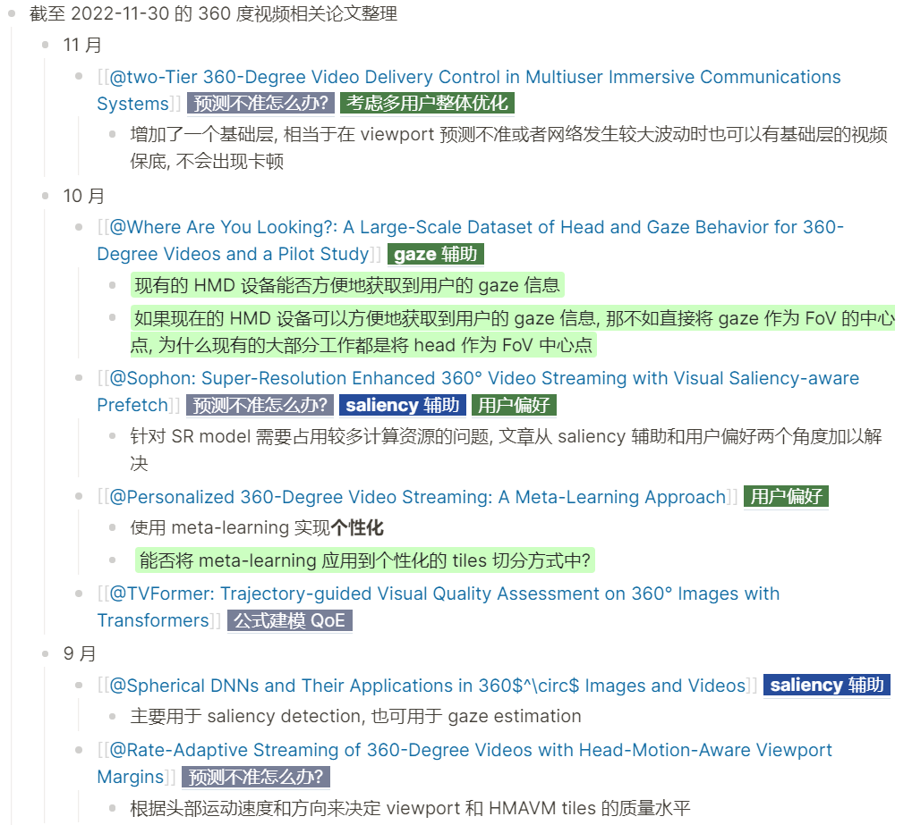

- [[周报]]
	- [[本周完成]]
		- ## 1. 中移
			- 根据反馈意见, 对报告进行了一些完善;
		- ## 2. 论文梳理
			- 对最近两三个月内接触到的关于360°视频的所有论文做了一个整理, 将其中涉及到的点纳入到了自己的idea树中. ==(展开此块可查看具体内容)==
			  collapsed:: true
				- 
			- ### 下面是得到的一些启发
				- **viewport prediction 有两个大的方向:**
					- 一个是尽可能提高viewport的预测精度, 主要方式有通过 saliency信息/motion信息/gaze信息 辅助预测
					- 另一个则是接受 "确实无法对未来较长一段时间内的viewport进行准确预测" 这一事实, 研究如何在viewport预测不准确的情况下, 依然给用户尽可能高的体验质量 (如避免卡顿等)
				- **个性化/用户偏好**
					- 很多论文都会在某一任务中加入 "用户偏好" 的考虑, 并将其作为自己的一个创新点
					- 其中最吸引到我的地方就是 "Personalized 360-Degree Video Streaming: A Meta-Learning Approach" 这篇论文, 它使用**元学习**实现了个性化的360°视频流系统, 这比之前的 "每个观众训练一个模型" / "每类观众训练一个模型" / "knowledge transfer" 要更高明, 更有可行性. ==这篇论文将基于tile的360°视频流系统中的两大过程 (viewport prediction & bitrate selection) 都用元学习做了个性化, 但是并未**将元学习应用到tiles切分方式的个性化上**——不知道这是否是一个具有可行性的点==
				- **元学习/强化学习**
					- 很多论文中都有 元学习/强化学习 的身影
	-
	- [[下周计划]]
		- 中移文档需进一步完善
		- 对元学习/强化学习进行更深入的学习, 目的是更深入理解它们的工作原理, 以便更好地思考它们可以解决哪些问题, 以及如何解决