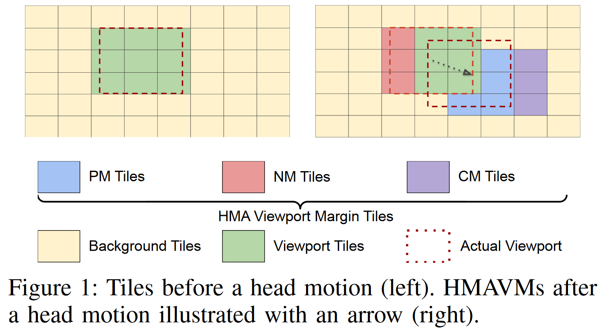
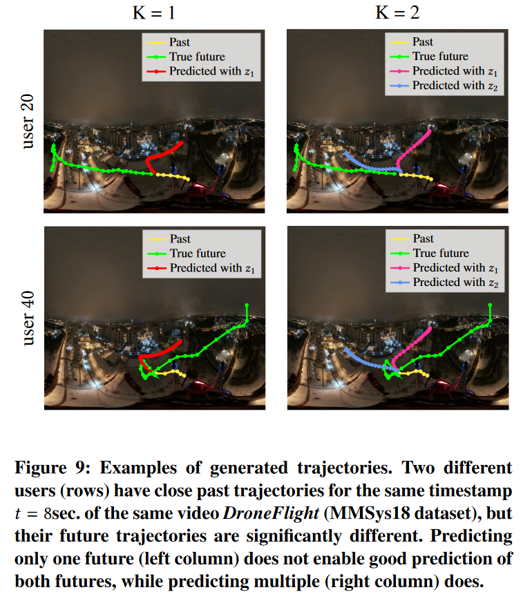

- [[周报]]
	- [[本周完成]]
		- 重点了解了强化学习、元学习等在论文中经常出现的概念
		- 看一些与360°流媒体系统相关的论文, 并想一些点
			- 广泛阅读后, 将主要切入点放在 "**viewport prediction**" 上
			- 想到的一些点主要如下:
				- ==(1) saliency map 和 "之前其他用户们的视点轨迹" 相互权衡==
					- 这个点之前就讨论过. 针对的是新上传视频的冷启动问题. 基本想法是, 对于新上传的视频, 收集到的用户视点数据很少, 此时主要通过salmap辅助viewport prediction; 但随着收集到该视频的实际用户视点数据变多, "之前其他用户们的视点轨迹" 变为比salmap更重要的信息
					- 或者再加一些其他的小点:
						- 比如不断用新收集到的视点数据对saliency模型进行离线训练更新, ~~或者考虑saliency模型的个性化 (有点困难)~~
				- ==(2) 视点预测时, 不止预测视点位置, 还预测视点运动速度==
					- 移动速度慢的视点, 比移动速度快的视点更重要
					- 但视点的速度是否有必要去预测? 直接通过相邻两视点的距离除以时间间隔就可以估算出来. 而且感觉这也是一个很小的点
					- 和下图思路有些像, 但又有些不一样
					  collapsed:: true
						- 
				- ==(3) 不同用户的视点轨迹具有异质性==
					- 不只预测单个视点轨迹, 而预测多个可能的视点轨迹
					  collapsed:: true
						- 
					- 使用 "元学习" 满足各个用户不同的 "viewport preference"
			- 一些更系统完整的整理可以展开此块查看
			  collapsed:: true
				- ## 基本
					- ### 当前用户的历史视点轨迹
						- 主要依据可能是head motion的惯性
						- 但只通过历史视点轨迹去预测未来视点轨迹肯定是不够的, 因为用户未来5s的视点轨迹, 一定不是由历史视点轨迹决定的, 而是受视频内容的引导.
						- 距离当前时间点越近的未来, 受历史视点轨迹的影响越大; 距离当前时间点越远的未来, 受历史视点轨迹的影响越小
				- ## 辅助
					- ### 之前其他用户们的视点轨迹
						- 主要依据是不同用户视点轨迹的相似性
						- 只能用于VoD, 不能用于直播
					- ### saliency map
						- saliency map的预测模型是根据用户实际的eye fixations训练出来的
						- ==saliency map 和 用户们真实视点轨迹 相结合并权衡? saliency 模型的离线训练更新? ~~元学习? 这里不考虑用户的个性化，而考虑视频的个性化~~== 在点播场景下不需要考虑saliency模型的实时性
						- "之前其他用户们的视点轨迹" 和 "saliency map" 更相近; motion map和object detection更相近;
							- 前两者都利用了用户视点数据, 有点端到端黑盒的意思; 后两者是基于人类的自然认知: 人更倾向于将视点固定在某一object上, 以及人的视点容易被运动物体所吸引.
							- 我认为在点播场景下, saliency map + 之前其他用户们的视点轨迹 就足够了; 如果是直播场景, 则无法获取之前其他用户们的视点轨迹, 所以可以saliency map+object detection+motion map, 但同时还要添加一些其它的考虑, 具体见下面对object detection和motion map的介绍.
					- ### object detection
						- 将检测出的objects作筛选, 识别出主要的objects. 具体怎么识别呢? , 或许可根据场景判断哪些objects是最重要的: 篮球赛中篮球和持球人是最重要的objects; 演唱会时歌手是最重要的object等等.
					- ### motion map
						- 将object detection和motion map结合? 因为用户会更在意主体object的motion, 而一些背景的细密的motion会被忽略(如雨天中的人)
					- ### ==音频辅助==
						- 一个比较大的脑洞: 用户可能将视线投向发出比较大声音的方向, 或者声音发生突变(响度、音色等)的方向
				- ## 用户视点轨迹的异质性
					- 元学习
					- ==多轨迹==
				- ==视点预测时, 不止预测视点位置, 还预测视点运动速度==
			- 主要困难
				- 还是感觉想点是个很痛苦的过程. 这周五之前一直在了解强化学习, 周五才开始重点选择一些论文去读, 将大的切入点定位于viewport prediction上, 因为总不能周报的时候只汇报在学强化学习啊, 然后重点选择了两篇论文, 一篇对视点轨迹进行多轨迹预测的, 用到了VAE(变分自编码器), 另一篇用了元学习, 又是两个不太熟悉的概念, 所以就又去了解这两个东西. 结果最后这两篇论文也没看特别明白, 又得交周报了, 只能硬挤出一些点来应付. 这些点也不具有全局的眼光
				- 我感觉自己目前还处于一个懂得太少需要学习的阶段, 同时也没有一个明确的任务目标; 但周报却需要有一些可汇报的东西 (总不能到现在还汇报说读了哪些论文, 学习了哪些机器学习算法). 这就使我学得时候很浮躁, 对每篇论文都似懂非懂, 又不敢深入研究, 因为怕深入去学以后, 一周的时间都砸在两三篇论文里, 到周报的时候没有可汇报的东西.
				- 其实这周痛苦的主要原因还是没有很好地找到一个目标, 然后根据目标导向工作, 可能是之前一直在做中移那边的工作, 忘记读论文的工作应该怎么做了2333
	- [[下周计划]]
		- 下周要注意**目标导向**, 专注于viewport prediction上, 做一些更完整的调研, 并对一些感兴趣的论文进行精读和部分复现, 尽快找到自己可以做的点