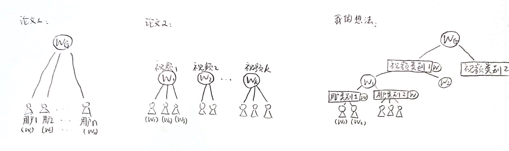
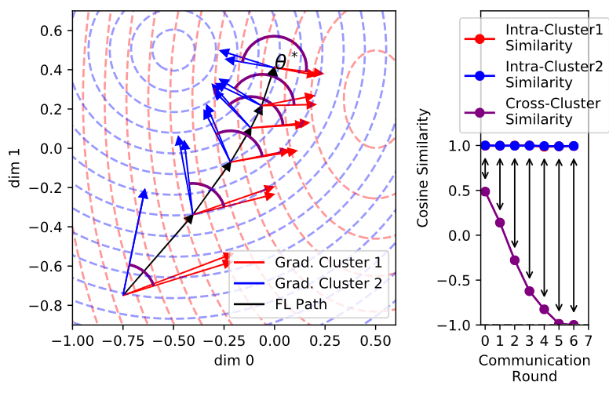

- [[周报]]
	- [[本周完成]]
		- ## 工作一  Requet复现学生作业的评分工作
			- 对9个组的Requet复现作业进行了实际的运行与评分 (感觉这次选这个题的组好多, 上次帮韩荣鑫学长运行学生作业的时候才两个组...)
			- [任务二得分公示.xlsx](../assets/任务二得分公示_1671881690043_0.xlsx)
		- ## 工作二  360度视频中视点轨迹预测 + 联邦学习
			- ### 1. 360度视频流系统, 应用 "联邦学习" 的相关工作:
				- 首先直接对目前在360度视频流系统中应用"联邦学习"的工作进行了调研, 基本是希望通过联邦学习做到两点: ==隐私保护 和 个性化==
				- 但目前在360度视频流系统中应用 "联邦学习" 的相关工作中, 还没有针对"个性化"这一点做完整的工作
				- 下图展示了其中两篇论文的思路以及我的想法:
					- {:height 267, :width 876}
					- **左图**: 其中论文1的思路最简单直接, 就是将最原始的联邦学习套到了 "360度视频视点预测" 这一场景中, 使用所有客户端模型的参数更新信息 训练出一个全局模型;
					- **中图**: 论文2的思路实际就是给每个视频单独训练一个模型, 而各个视频之前的权重不互通, 这相当于对不同视频的视点预测模型做了个性化, 但是:
						- 一方面, 论文2没有针对不同视点轨迹模式的用户做个性化;
						- 另一方面, 论文2的思路使不同视频模型的参数完全不互通, 这一方面会有冷启动的问题: 即对于一个新上传的视频而言, 它的模型要从头开始训练; 另一方面, 各个视频模型训练时只能用少量数据训练, 可能无法取得较好的性能
					- **右图**: 针对论文2的两个问题, 我产生了一个 "更加细粒度的联邦学习" 的思路.
						- 它首先将论文1和论文2结合, 即: 首先有一个全局模型 $W_G$, 然后再下一层是每个视频有一个模型, 再下一层是每个用户有一个模型, 这样就是3层.
						- 之后, 该思路为了更完整地实现个性化, 又添加了两层, 即 "用户类别层" 和 "视频类别层", 从而保证 只将视点轨迹模式相似的用户的 "参数更新信息" 进行聚合.
						- 该思路打眼一看就可能有两个问题:
							- 需要更多的计算开销(聚类)和存储开销(模型变多), 能否保证实时性?
							- 为了实现个性化, 对用户进行了更细粒度的划分, 用于联邦训练的数据比论文2进一步减少, 模型性能甚至可能会下降;
			- ### 2. "联邦学习" + "个性化" (不局限于360度视频领域)
				- 可以通过多种方法在联邦学习中实现个性化, 主要有:
				  collapsed:: true
					- Data Augmentation, Client Selection, Regularization, Meta-Learning, Transfer Learning,
					- Parameter Decoupling, Knowledge Distillation, Multi-Task Learning, Model Interpolation, Clustering
				- 我主要将重点放在了 "==通过Clustering在联邦学习中实现个性化=="
				- 在联邦学习中做聚类, 一个最重要的难点是: ==中心服务器无法获取到原始数据==, 因此不能利用原始数据进行聚类, 现有的基于用户历史视点轨迹对用户进行聚类的研究也就基本失去了参考价值
				- 目前在联邦学习中做聚类, 主要有以下两种思路:
					- **(1) 将客户的"==梯度更新=="信息作为聚类依据**
						- 如下图所示, 随着传统的FL不断收敛(黑色路径), 蓝色簇和红色簇之间的"梯度更新"的相似性越来越小, 而簇内的"梯度更新"的相似性始终较大. 因此客户的"==梯度更新=="信息可以作为一个聚类依据
							- 
					- **(2) 让每个客户端自己决定自己的聚类**
						- 在中心服务器上始终维护K个模型, 每轮通信, 服务器都会将K个模型的参数下发至每个客户端, 客户端对K个模型都进行尝试, 通过 "哪个模型在当前客户端数据上的==**损失函数值**==最小" 来自主选择适合自己的模型
	- [[下周计划]]
		- 开始实际着手做一下 基于"联邦学习+聚类"实现个性化视点预测的工作