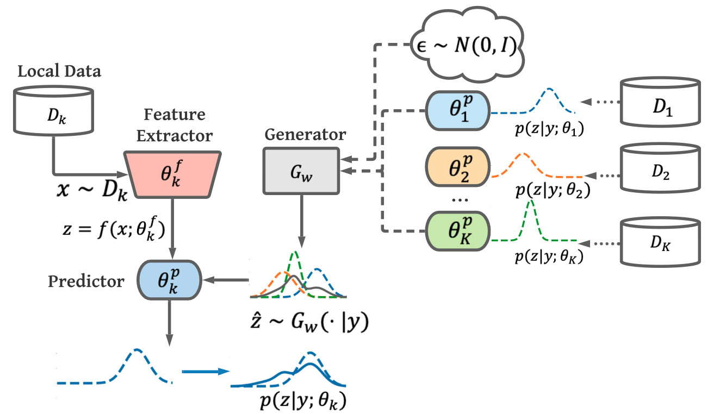
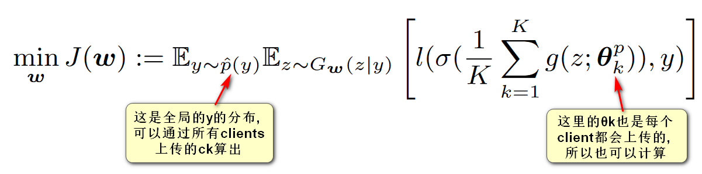
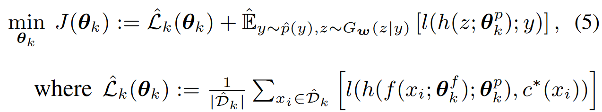
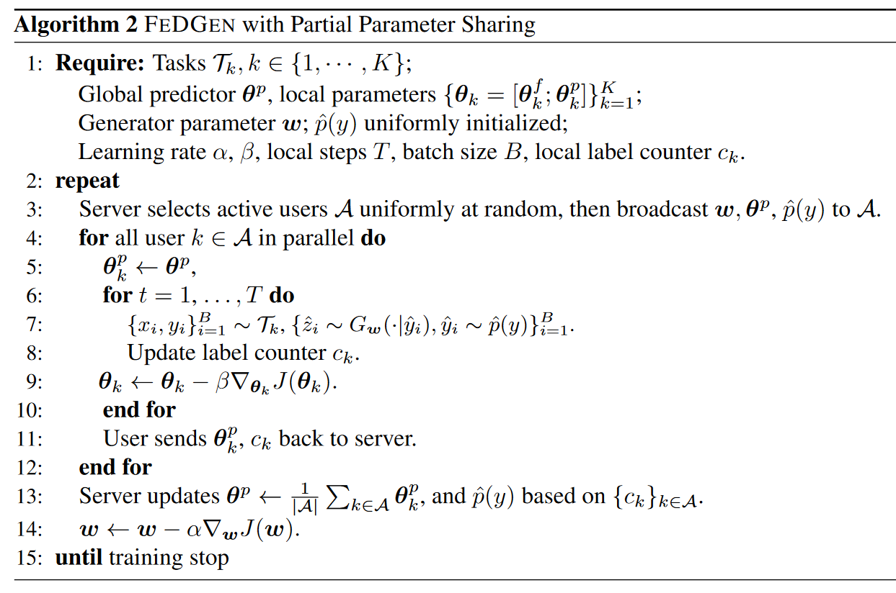

- [[周报]]
	- [[本周完成]]
		- ## 视点轨迹预测
			- ### 调研与讨论
				- 上上周初步确定采用 **联邦学习+知识蒸馏** 这一思路去做 (通过知识蒸馏, 实现更加灵活的个性化, 同时缓解个性化时的过拟合问题). 因此, 上周首先针对这一方向做了一些调研.
				- 在联邦学习中融入知识蒸馏, 传统方式是在一个公开的"代理数据集"上做知识蒸馏, 但很多实际的应用场景中无法获取到那么具有代表性的"代理数据集".  在与师兄讨论过后, 决定重点关注一篇 ICML 2021 的文章: `《Data-Free Knowledge Distillation for Heterogeneous Federated Learning》`, 它利用**生成学习**, 实现了**FedGen**: 一种 "==不需要代理数据集==就可以在联邦学习中做知识蒸馏" 的方法.
			- ### FedGen 的具体思路
				- **核心思路**:
					- ==既然没有代理数据集, 那么就用一个"生成模型"来生成数据, 在生成的数据上做知识蒸馏.==
				- **尽可能精简的表述:** (通过图来说明)
					- 
						- **1. 本地模型训练:** 每个client的本地模型都分为两部分: `Feature Extractor` (粉色倒梯形) 和 `Predictor` (蓝色圆角矩形).  数据流为: $$x \rightarrow [Feature Extractor] \rightarrow z (特征) \rightarrow [Predictor] \rightarrow 最终输出$$.  本地模型在训练时, 对于一个训练样本 $(x, y)$, 在损失函数中同时考虑两项:
							- $loss_{total} = loss(p(f(x)), y) + loss(p(\hat{z}), y)$
								- 公式中的 $f$ 表示 Feature Extractor, $p$ 表示 Predictor, $y$ 表示ground truth label, $\hat{z}$ 表示Generator $G_w$ 根据 $y$ 生成的具有global view的特征向量;
								- 损失函数中的后一项 ( $loss(p(\hat{z}), y)$ ) 就相当于从全局的 $G_w$ 模型上蒸馏出的知识.
						- **2. Generator** $G_w$ **的训练:** server会用各个clients上传的信息训练一个全局的 Generator $G_w$  , 总之训练的目标是: 希望 $G_w$ 在接收到一个ground truth label $y$ 作为输入之后, 能够输出一个最符合全局信息的 $\hat{z}$  (实际上是输出 $\hat{z}$ 的分布, 但说输出$\hat{z}$ 会更便于理解和讲述).  训练完成后, server会将训练好的 $G_w$ 下发给每个client.
				- **更详尽的表述:** (有实际公式)
				  id:: 63ba8f23-fd72-4896-b120-820e1da51eda
				  collapsed:: true
					- 1. client k 训练好本地模型 $\theta_k$ 之后, 向server上传 $\theta^p_k$ 和 $c_k$  ;
						- 其中 $\theta^p_k$ 是本地模型中Predictor部分的参数,  $c_k$ 是本地数据集中 ground truth label 的每种取值对应多少样本数;
					- 2. server在接收到各个client上传的信息后, 通过下面这种方式训练生成器 $G_w$ :
						- 
					- 3. server将全局的Predictor模型 $\theta^p$ 和生成器 $G_w$ 都下发给每个client.   client用 $\theta^p$ 覆盖掉自己当前的 $\theta^p_k$ 之后, 通过下面这种方式训练本地模型 $\theta_k$:
						- 
				- **伪码**:
				  collapsed:: true
					- 
	- [[下周计划]]
		- 目前已经跑通了FedGen的开源代码, 下一步计划选择一个比较有名且合适的视点轨迹预测数据集, 将FedGen用在上面, 看看性能如何
		- ==**目前的难点**==
			- 目前开源的FedGen是针对 "多分类" 问题的 ==(模型输出为离散值)==; 而视点轨迹预测是一个时间序列预测问题 ==(模型输出为连续值)==. 这就带来了一个问题:  FedGen需要用到ground truth label的分布, 这在多分类问题中很好解决, 比如1个样本属于类别A, 2个样本属于类别B, 3个样本属于类别C, 那么ground truth label的分布就是 [1, 2, 3]; 但是如果要训练输出值为连续值的模型, 就==需要在模型训练的原代码的基础上增加一个 "将ground truth离散化" 的操作. 与师兄的讨论之后, 感觉还可以根据用户具体设备的算力, 来调整离散化的粒度.==
				- > 吐槽: 仔细想想, 其实终归是要将连续的ground truth离散化的, 因为在模型训练时 (无论是全局的 $G_w$ 还是本地的 $\theta_k$), 都有求期望的操作 (可参考这个块中的公式 : " ((63ba8f23-fd72-4896-b120-820e1da51eda)) " ), 这里的求期望, 应该只能通过将连续值离散化后求加权平均; 
				  并且, 虽然说我们在模型训练时将ground truth离散化了, 但我们的模型在实际做预测的时候, 还是可以输出连续值.