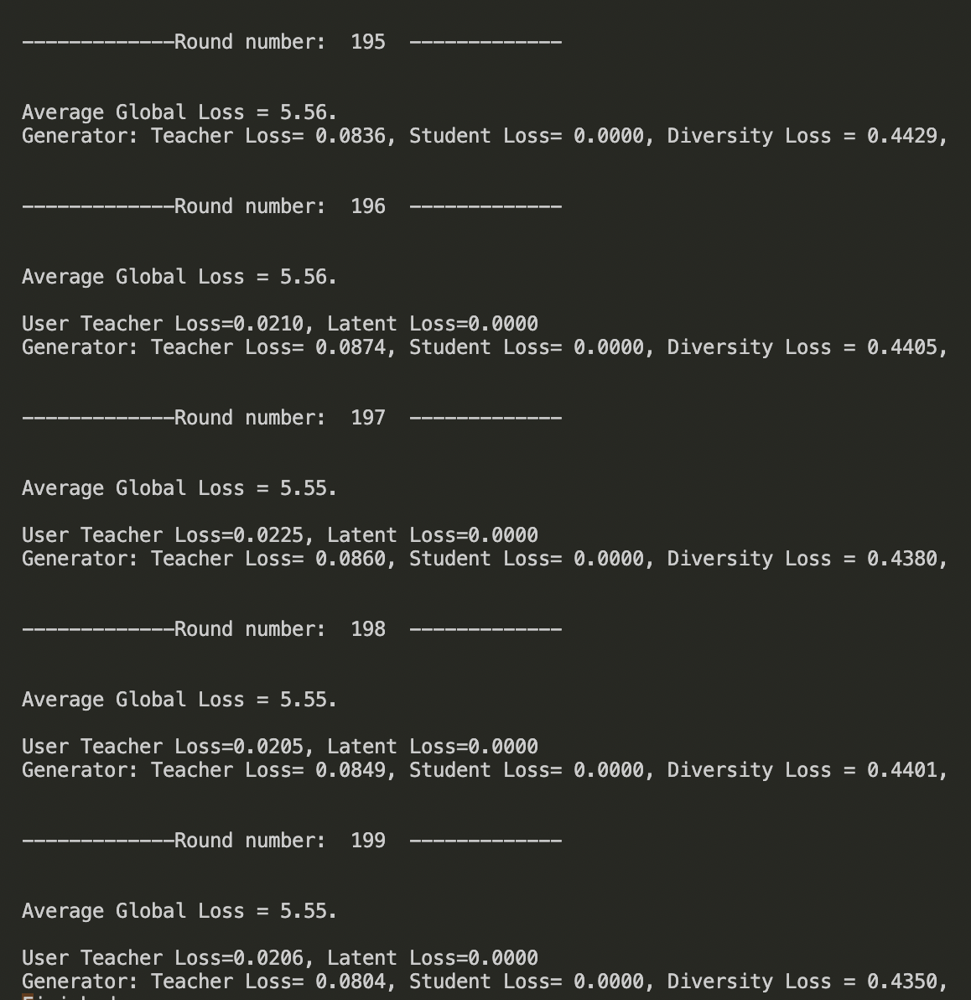

- [[周报]]
	- ### 简述目前在做的工作:
		- 使用一个结合了==**知识蒸馏**==和==**联邦学习**==的框架`FedGen`, 训练出具有==**隐私保护**==和==**个性化**==优势的**==视点预测模型==**
	- ### 难点一 (已基本解决): 将FedGen框架从"分类问题"向"多维时间序列预测问题"转换
		- 原始的FedGen框架是针对"分类问题"设计的, 但是我们的"VP预测"任务是一个"多维时间序列预测"问题, 相比于分类问题, 它要求模型的输出是"**==连续的==**", 而且是"**==多维的==**"; 因此需要对整个原始框架的代码进行修改. (要修改的地方零散地遍布在整个代码中, 还是挺麻烦的, 但最终完成以后也还蛮有成就感的, 而且感觉对整个核心代码的实现思路和具体结构都了如指掌了)
		- **对原代码进行的改动可概括如下: **
			- ==**最主要: 处理labels的分布**==
				- ==FedGen框架需要训练一个全局的生成模型, 该生成模型在训练时, 需要得到全局的labels分布. 这在分类问题中很好解决, 因为分类问题中的labels是 "**离散**" 且 "**单维**" 的, 所以只要每个user_model在训练过程中不断将自己当前batch中每种label出现的次数发送给服务器即可, 服务器最终就能得到labels的全局分布. 但是在"多维时间序列预测"问题中, labels是**"连续"**且**"多维"**的, 我们应该怎么计算它的全局分布呢?==
				- 目前采用的思路比较简单直接, 就是在训练全局的生成模型时, 将连续的labels离散化. 这里注意, 虽然我们在训练生成模型时, 传给它的labels都是离散值, 但是在用生成模型作预测时, 我们可以直接传给模型连续的labels.
				- > 除了上述思路之外, 还有没有其它更好的方法? 目前是否有针对连续labels的生成模型训练方法? 我们甚至可以直接完全修改掉原有FedGen中的生成模型的结构及其训练方式, 但这或许不是我目前工作的重点.
			- **修改各处的loss函数**
			  collapsed:: true
				- 原代码中采用的是针对分类问题的loss函数, 如NLLLoss, CrossEntropyLoss等, 目前统一将所有loss函数设定为MSELoss
			- **添加新的model**
			  collapsed:: true
				- 代码中原有的models都是针对分类问题的, 需要添加LSTM, Transformer等可以解决时间序列预测问题的模型. 目前添加了LSTM模型, 还未尝试Transformer模型.
		- 将重要的代码文件梳理如下:
		  collapsed:: true
			- models.py: 定义model的结构
			- userpFedGen.py: model的训练
			- generator.py: 定义generator的结构
			- serverpFedGen.py: generator的训练
	- ### 难点二: 模型的结构设计与参数调优
		- 原FedGen框架中的很多设定都是针对分类问题的, 不一定适合于我们的视点预测问题
		- ==对模型的结构进行精心设计, 并且完成参数调优, 是下一个要攻克的难点, 也是下周的主要工作.==
	- ### 目前的模型性能
	  collapsed:: true
		- 目前还没有进行细致的调参
		- 
	- ### 服务器上原本配好的torch+cuda环境突然跑不了cuda了
	  collapsed:: true
		- 原代码没有将模型放在gpu上跑, 这真挺令人费解的, 明明就加几行代码的事. 之前我跑这个代码一直用的cpu, 因为想着先将FedGen修改成可以训练时间序列预测模型再说.  这周不是基本改完了嘛, 就将程序改写成了可以再cuda上跑的, 结果一跑以后发现, 原本我们服务器上配好的torch+cuda的环境跑不了cuda了, 大概从网上查了一下, 有说是因为nvidia-fabricmanager在系统自动更新或者apt-get update、apt-get upgrade等过程中被更新了, 才导致了这个问题.
		- 下周需要做模型调参工作, 需要模型训练的速度尽可能快一些, 所以还是要花时间解决一下这个问题.
	- ### ==提纲==
		- **实验** (用横线划掉的是本周完成的)
			- **框架方面**
				- ~~将FedGen框架从"分类问题"向"多维时间序列预测问题"转换~~
				- 复现一些基线框架, 用于说明FedGen框架下训练出的模型的性能 (FedAvg, Local等)
			- **模型方面**
				- 设计视点预测模型并调参 (尝试LSTM, Tranformer等)
			- **性能测试** (可以从哪些方面说明性能)
				- 整体上更精确的预测
				- 看每个用户的模型训练情况, 说明一些问题
				- 说明我们的框架有更好的隐私保护性