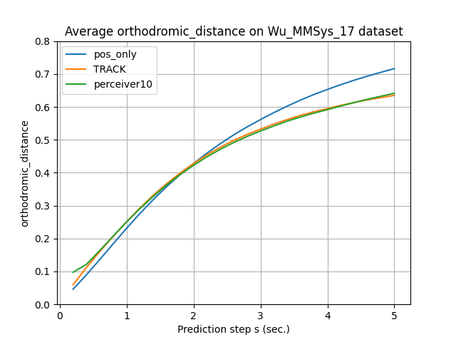
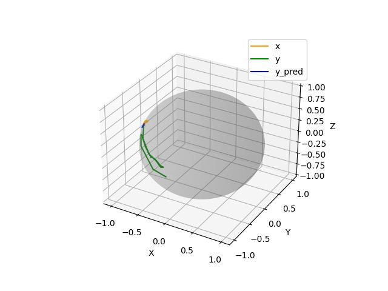

- [[周报]]
	- 1. 了解了ICASSP和WWW两个会议的论文篇幅和投稿时间等要求
		- ICASSP是B会, 正文是4页, ==ddl是9月7号==;
		- WWW是A会, 正文是8页, ddl是10月12号;
	- 2. 在ICASSP和WWW上, 各找了两篇和我工作相似的, 即VP预测相关的论文看了下
		- WWW上目前还没有纯VP预测的, 都是又结合了一些ABR的工作, 可能是单单一个VP预测的工作扩充不到8页的篇幅;
		- ICASSP在19年倒是有一篇纯VP预测的文章, 感觉写得也比较简单;
	- 3. 在与盛师兄共同讨论之后, 目前初步按照ICASSP的篇幅要求, 以VP预测任务中涉及到的==**多种模态数据融合**==为核心点写了一个==初步的论文大纲/故事梗概==:
		- # LONG-TERM VIEWPOINT PREDICTION IN 360 VIDEOS: A MULTI-MODAL FUSION APPROACH BASED ON CROSS-ATTENTION MECHANISM
			- ## 1. INTRODUCTION
				- ### 背景
				  collapsed:: true
					- 为什么要做VP预测
				- ### 现有工作及不足
					- 现有的VP预测方法通常会考虑两种类型的信息:  "历史视点轨迹(==HT==)" 和 "视频内容信息(==VC==)";
					- 常见的 VC 信息有
						- saliency map
						- motion map (optical flow)
						- object detection
					- [[@TRACK: A New Method From a Re-Examination of Deep Architectures for Head Motion Prediction in 360 Videos]] 表明: 视点的短期运动主要是由t的惯性驱动的，而内容显著性可能会影响长期轨迹。因此需要同时考虑HT和VC才能对视点运动进行更加准确的长期预测;
					- 但是,  HT 和 VC 通常是不同模态的两种数据:
						- HT
							- 单位球坐标: (x, y, z)
							- 经纬度: (theta, phi)
							- 四元数: (qx, qy, qz, qw)
							- 欧拉角
						- VC
							- ERP格式的saliency map / motion map
					- 现有工作结合 HT 和 VC 这两种数据的方式一般有两种:
						- 将HT和VC都处理成一维特征张量, 然后进行拼接;
							- 模型无法充分学习跨模态的知识;
						- 将HT处理成类似于salmap的ERP格式热力图, 相当于把HT处理成VC的模态;
							- 增大了计算开销;
					- 可以看出, 现有的工作还没有对VP预测任务中涉及到的多种模态数据之间的融合做细致的考虑
				- ### 本文工作
					- 本文使用一个基于注意力机制的模型架构, 更好地融合了不同模态的HT和VC数据, 实现了更加精确的长期视点预测.
					- 此外, 我们将salmap从原始的ERP图转换成 "坐标+显著性值" 的形式, 不仅向sal这种模态中注入了HT信息, 而且在一定程度上避免了ERP投影畸变的影响;
					- 最后, 我们还为每个用户维护一个可训练张量, 在预测时作为一个单独的模态输入模型, 实现对不同用户的个性化VP预测;
			- ## 2. PROBLEM FORMULATION
			  collapsed:: true
				- 假设对于视频集V和用户集U, 我们有 "用户视点轨迹" 数据集 DVT 和 "显著性图" 数据集 DSM. 同时为了方便起见, 我们假设每个视频的时间点数量均为T, 而且根据 [[@A unified framework for multi-modal federated learning]] 的建议, 我们以0.2s的粒度提取并预测视点，而不是视频的每一帧, 因此每两个相邻时间点的时间间隔为0.2s。
					- DVT中存储了每个用户在观看每个视频时的视点轨迹, 其中每个时间点的视点位置使用三维坐标中单位球的空间坐标(x,y,z)表示, 因此shape=(|V|, |U|, T, 3), 取值范围为[-1, 1]
					- DSM中存储了每个视频在每个时间点处的saliency map, 每张salmap都是一个H \times W 的二维矩阵, 矩阵中每个元素的值都是ERP格式帧上相应区域的显著性值. shape=(|V|, T, 1, H, W)
				- 模型通过过去M个时刻的视点轨迹以及过去M个时刻和未来H个时刻的视频内容信息, 预测未来H个时刻的视点轨迹.
				- $$
				  \theta = arg \ min \ E_t [ DVT[t+1, t+H ], F ( [DVT[t-M, t], DSM[t-M, t+H] ]; \theta ) )]
				  $$
					- [[#green]]==增加 \Sigma==
			- ## 3. MULTI-MODAL FUSION BASED ON CROSS-ATTENTION MECHANISMS
			  collapsed:: true
				- 偏理论, 弄一些公式
			- ## 4. PROPOSED METHOD
				- 模型总体结构
				- 多模态
					- 具体是怎么用到视点预测上的;
					- 比如使用到了哪些不同模态的数据作为输入;
					  collapsed:: true
						- 除了pos和sal, 还应该[[#green]]==增加motion map等模态==; 因为感觉只两个模态的话太少;
				- ERP投影失真
					- salmap上进行均匀采样, 并注入pos信息, 并取前20%, 并以5为步长;
				- ~~个性化~~
				  collapsed:: true
					- 每个用户维护一个可训练张量, 作为模型的输入;
						- 冷启动?
				- 训练时模型的具体参数设置
			- ## 5. EVALUATION
			  collapsed:: true
				- ### 5.1. Settings
					- **Datasets.**
					- **和哪些算法进行比较.**
					- **Performance Metrics.**
						- 准确性
						- ~~轻量性~~
						  collapsed:: true
							- 模型大小
							- 训练与测试时的空间开销算力开销时间开销
				- ### 5.2. Performance
			- ## 6. CONCLUSION
	- 4. 但是目前尝试了各种各样的方法, 新模型VP预测的准确程度还是只能勉强与比较对象持平; 连最基本的实验效果都做不出来
		- 
	- 5. 目前已做过的主要尝试包括但不限于:
		- (1) 从数据预处理角度:
			- 将pos或者sal经过线性层处理;
			- 将sal从ERP格式的salmap转换为(x, y, z, sal_value)的格式; 相当于向sal信息中融入了pos信息;
			- 将每个时间点pos信息, 即(x, y, z), 先接一个trainable_param, 再expand成和sal信息相同的形状;
		- (2) 从模型结构角度:
			- 原始的perceiver io的各种超参;
			- 先将pos和sal之间进行双向的跨注意力, 再送入perceiver io;
			- 先用pos去query sal, 得到pos_sal, 再将pos_sal和sal送入perceiver io;
	- 6. 根据盛师兄的建议, 将loss大的那些样本画了一下, 发现大概都是图里这种情况:
	  
	  x (黄) 是过去3s的视点轨迹; 是模型输入;
	  y (绿) 是未来5s的实际视点轨迹; 是ground truth;
	  y_pred (蓝) 是模型预测出的未来5s视点轨迹;
	  
	  现在就是感觉, 神仙来了也预测不了图中的情况: 前3s视点一直集中在小区域, 之后5s开始大范围移动;
	  
	  目前能想到的解决方案, 一个是换其它数据集看看 (目前一直在用vr-dataset, 因为数据量大且在多篇文章中被使用); 另一个就是必须给模型更丰富的输入信息, 因为目前来看, saliency map能提供的信息已经被压榨到极限了;