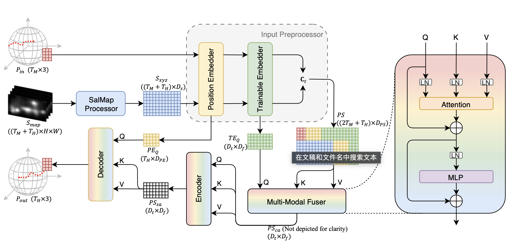

- [[周报]]
	- ## IDEA1: time-varying fusion of HT and VC (Sal)
		- ### 主要思想
			- 
			- 
		- ### 问题
		  collapsed:: true
			- 虽然RainbowVP在短期预测时给recent 2s HT更高的注意力, 在长期预测给VC and earlier HT更高的注意力, 但这并不能说明对于短期预测来说recent 2s HT更重要, 对于长期预测来说VC and earlier HT更重要. 感觉逻辑反了.
	- ## IDEA2: 多模态融合
		- 辅助视点预测的信息, 除了saliency map, 还有很多种: motion map, 其它用户的视点数据等; 
		  RainbowVP又可以很方便地进行模态的更改和扩展, 所以想探究在RainbowVP架构中, 哪种辅助信息的作用最强, 以及使用所有4种模态进行预测时是否会有更高的视点预测性能.
			- 由于之前的其它VP模型都针对模态做复杂的设计, 所以不方便进行模态的更改和扩展, 因此这个工作还没有人做过;
			- 但是在特定的RainbowVP架构中的比较结果
		- ### representations
			- 主要思想
				- 
			- 优点
				- 降低了数据量和模型规模
				- 使各个模态的形式更统一 (都是点的形式)
				- 一定程度上解决了投影失真问题
		- ### 主要实验
			- pos+saliency
			- pos+motion
			- pos+users
			- pos+saliency+motion+users
			- 观察使用3种模态时在实际数据上的预测性能, 说明它们是否对不同类型的数据有帮助, 说明他们是否提供的是互补的信息
			- 我还想说明saliency map和motion map在辅助视点预测时不需要CNN等的处理
		- ### 目前结果
			- 