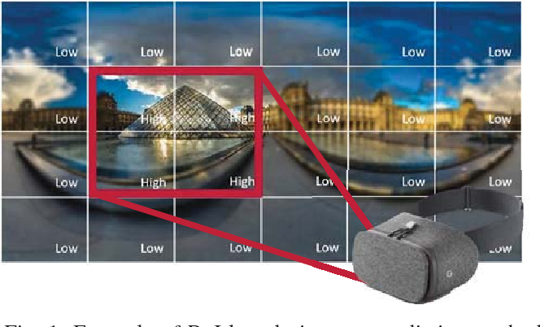
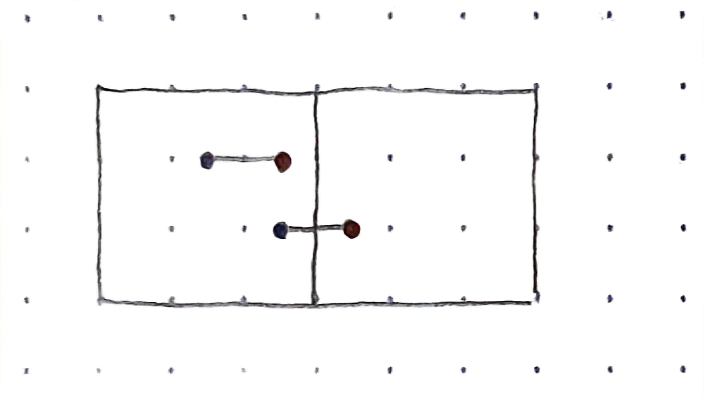
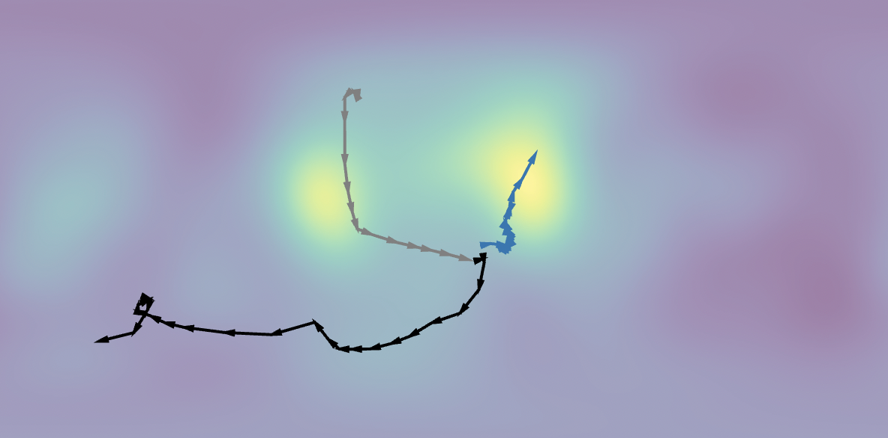
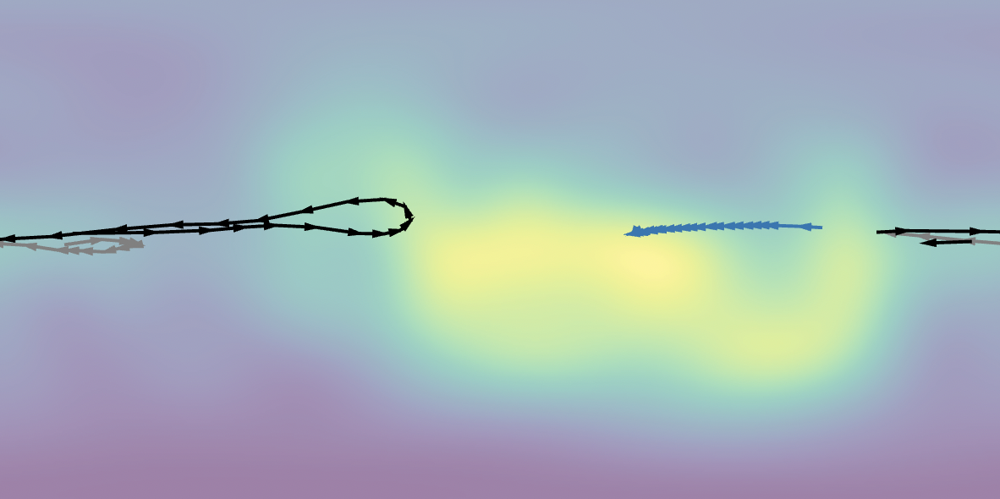
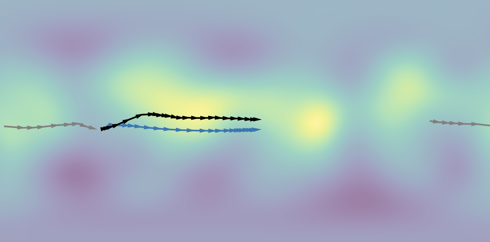
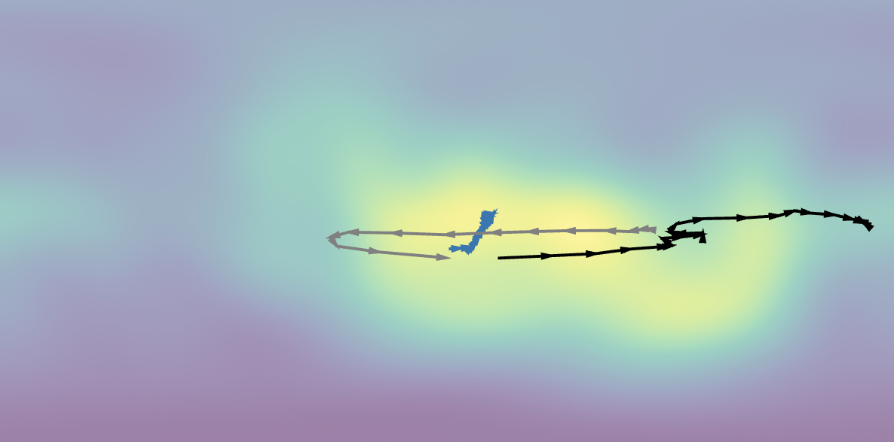

- [[周报]]
	- ## Idea2的确定
		- ### 总体思路
			- Idea1所做的 "视点预测" 只是360° video streaming的前半部分:
				- 360° video streaming = viewport prediction + tile-based ABR
				- {:width 400}
			- 因此Idea2决定将立足点放在 "==Idea1中的视点预测模型, 怎么更好地为下一阶段的ABR服务==" 上
				- 也能更好地说明Idea1所做工作的实际意义
		- ### 具体想法
			- **考虑在损失函数中增加 "视点预测值 和 视点实际值 跨tile边界时的惩罚项"**
				- 同样大小的预测误差, "跨tile边界" 相比于 "不跨tile边界", 对QoE影响更大
					- {:height 158, :width 279}
				- $$Loss(y_{pred}, y) = dist(y_{pred}, y) + isCross(y_{pred}, y)$$
			- **考虑降低损失函数对过于难以预测场景的敏感度**
				- Idea1是训练模型在所有情况下平均的预测误差可以最小;
				- 但有些情况下是不可能做出准确的长期视点预测的, 预测出来也误差很高, 没法用于后续的ABR; 而且当模型学习这些情况时, 可能会对模型预测好预测的情况下的性能产生负面影响;
					- {:width 300} {:width 300}
				- $$Loss(y_{pred}, y) = arctan(dist(y_{pred}, y))$$
			- **再增加一个模型, 对视点预测模型的预测误差进行预测**
				- 之前的工作普遍使用概率分布函数, 对所有情况下的预测误差的分布进行拟合; 没有考虑到不同情况下预测误差会有较大差异;
					- {:width 300} {:width 300}
				- 因此想到可以新增一个预测 "预测误差" 的模型, 其输入和视点预测模型一样; 目的是区分出预测误差小和预测误差大的情况, 分别采用不同的ABR策略 (深度 or 宽度)