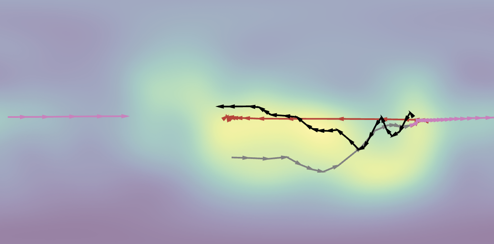
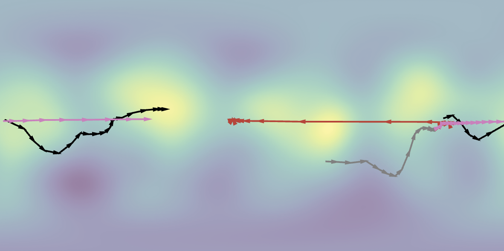
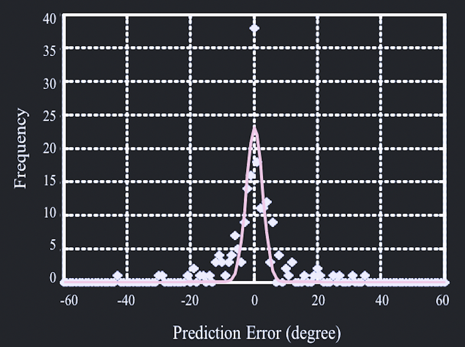
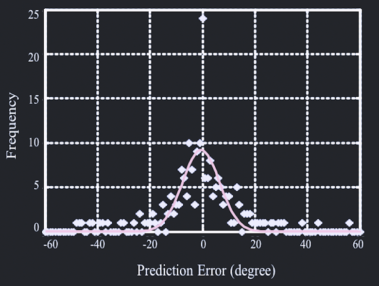
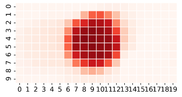
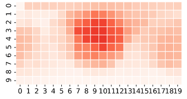
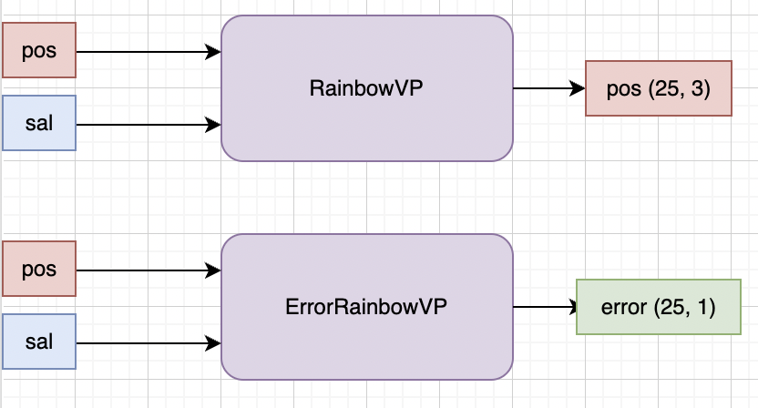
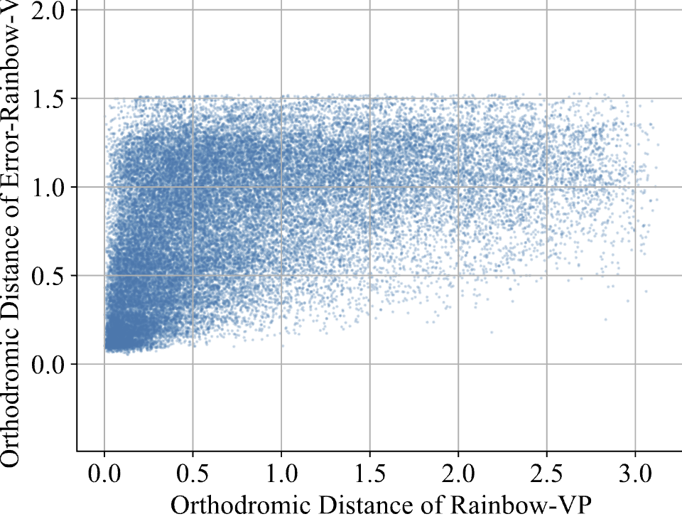
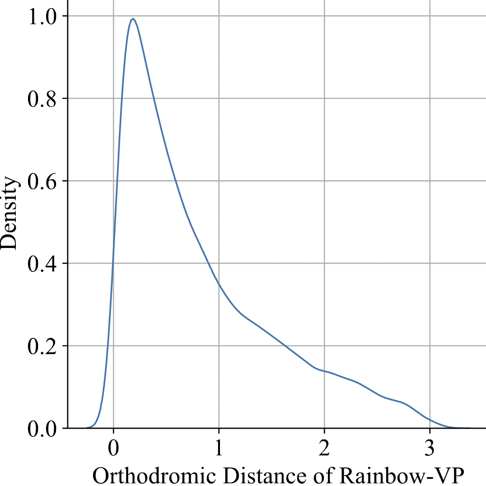
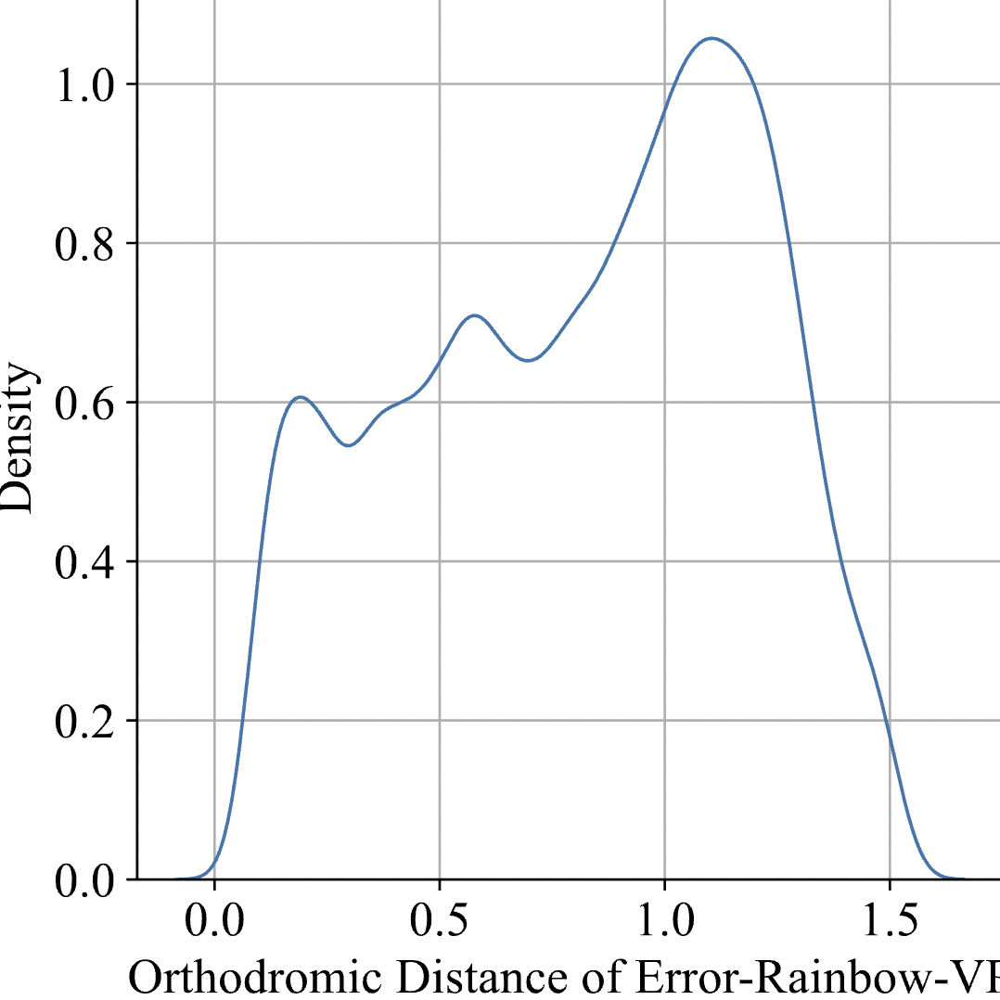

- [[周报]]
	- # Idea2: 想办法得到每个视点预测值的概率分布, 应用于后续基于tile的ABR
		- ## Motivations
			- idea1研究了单纯的长期视点预测模型. 为了进行更准确的长期视点预测, 设计了一个基于注意力机制的模型进行两种模态的时变融合.
			- 但是长期视点预测模型想要用到后续的ABR上, 存在一些独有的问题和可优化的点
			- 长期视点预测, 相比于短期, 不确定性更高, 容易产生更大的预测误差, 小的预测误差和大的预测误差可能会相差很多
				- {:width 300} {:width 300}
				- {:width 300} {:width 300}
				- {:width 300} {:width 300}
				-
			- 之前的工作在考虑视点预测误差时, 常通过正态分布对预测误差的分布进行拟合, 相当于对于好预测的场景和难预测的场景都采用相同的预测误差分布函数
			- 所以, 一个自然的想法是: 如果能够将模型预测误差小的数据和预测误差大的数据分辨出来, 分别采用不同参数的正态分布进行表示, 就能够更有针对性地进行bitrate分配, 从而提高用户QoE
		- ## Experiments
			- ### 数据分析与拟合
				- **误差预测模型的模型结构**
					- {:width 400,:height 800}
				- **误差预测模型的训练与测试**
					- **David_MMSys_18  m15-h25**
						- python plot.py --dataset_name David_MMSys_18 --m_window 15 --h_window 25 --init_window 30 --metric orthodromic_distance
							- 在val set上训练, test set上验证的error_perceiver6模型:
								- Rainbow-VP (ours): 1.0347301734341394
								  Eror-Rainbow-VP: 1.05828141067641
								- {:width 400,:height 800}
				- **条件概率密度函数**
					- $$f_X(x|Y=y) = \frac{f(x, y)}{f_Y(y)}$$
					  $$X: 实际的VP预测误差$$
					  $$Y: 预测出的VP预测误差$$
					- $f_X(x)$ (左) 和 $f_Y(y)$ (右) 的核密度估计(kde)图
						- {:width 280} {:width 280}
			- ### compatitors
				- 所有tiles平均分配bitrate (不作视口自适应)
				- 只给预测视口内的tiles分配bitrate (不考虑视点预测的误差)
				- 将所有情况下的视点预测误差分布采用一个正态分布表示 (考虑视点预测误差, 但是不区分好预测的情况和不好预测的情况)
				- 对不同prediction steps的视点预测误差采用不同参数的正态分布 (基于一个思想: prediction step越大, 预测误差越大)
				- Proposed
			- ### pseudo-code
				- 基本思想是按照视点分布概率确定tiles的bitrates
				- 不考虑bandwidth的变化和预测, 将bandwidth设定为恒定值
				- ```python
				  def ABR():
				    for ci in range(5):  # 对于每一个chunk (每个chunk是1s)
				      tilemaps = []
				    	for si in range(5):  # 对于每一个sampled point (每0.2s采样一次, 所以一个chunk中有5个采样点)
				        i = ci * 5 + si
				        pos_pred = get_pos_pred(i)
				        tilemaps.append(get_tilemap(pos_pred, ...))
				      tile_map = norm(mean(tilemaps))
				      
				      bitrate_map = tile_map * B * 1  # B为带宽, 单位为bit/s, 因为一个chunk的时长是1s, 所以B*1就表示可以分配给一个chunk的数据量;
				      bitrate_map = discretize(bitrate_map)  # 选择最接近的bitrate level进行分配; 
				      # 最终bitrate_map中就存储了给ci这个chunk的每个tile分配的bitrate level
				  ```
			- ### metrics
				- 真实视口内的bitrate
		- ## 其它不确定性建模的方法
			- 如贝叶斯神经网络或蒙特卡洛方法等
		- ## Questions
			- 具体使用什么分布拟合 $f(x, y)$ 和 $f_Y(y)$? (拟合难度大, 可能拟合不准确)
			- 实验还很单薄, 是否可以做一些其他的丰富?