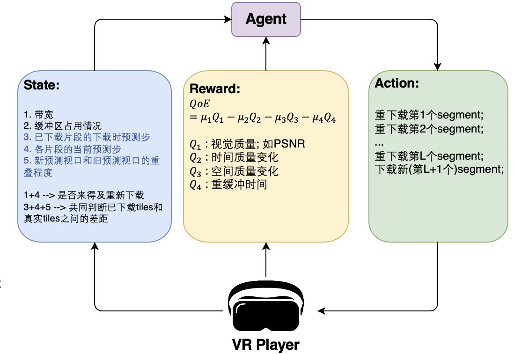

- [[周报]]
	- ## 开题; 明确第二个点要做的工作
		- ### Idea1和Idea2的关系
			- {:width 564, :height 203}
			- 第一个点做的是单纯的长期视点预测
				- --> 视点预测放到实际的视频传输中才有意义
					- --> 但直接将长期视点预测模型用到传统的全景视频传输系统中会存在一些问题
						- --> idea2就是发现其中某个问题并提出解决方案
		- ### Idea2具体要做的问题
			- 长期视点预测仍然存在较大误差，如果直接将长期视点预测模型应用于传统的全景视频自适应传输框架中，系统将会频繁按照误差较大的预测视点进行各tiles的比特率分配和预取，用户实际视口内将经常看到低质量画面甚至黑区，严重影响观看体验。因此，第二个点计划设计一个 "引入在线视口纠偏机制的" 自适应传输算法，增强系统对长期视点预测误差的鲁棒性。
	- ## 目前进展
		- ### 理论
			- 目前有一个基于强化学习去做的思路; 并且初步完成了三要素的定义:
				- {:width 500,:height 800}
		- ### 实验
			- 目前初步搭建好了完整的全景视频流传输模拟环境, 包括视点预测和自适应比特率策略。
			- 接下来会
				- 首先在上述环境平台上新增我idea1的视点预测模型,
				- 然后实现我第二个点的 "引入在线视口纠偏机制的" 自适应传输算法