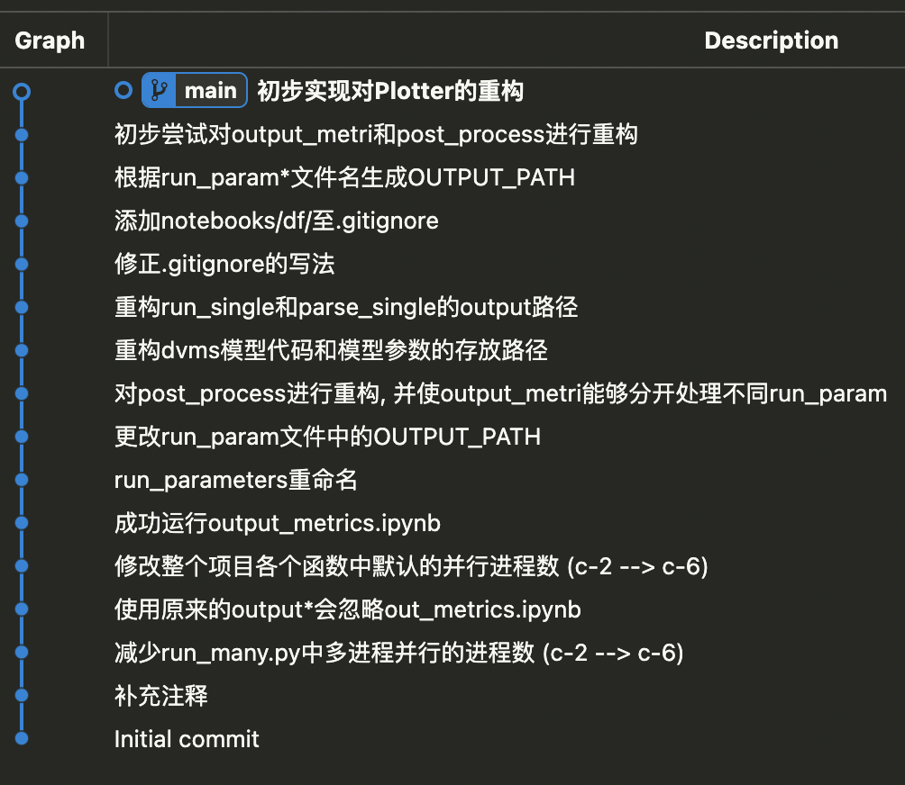

- [[周报]]
	- ## Idea2 - 引入视口纠偏机制的自适应传输算法
		- ### todo list
			- **准备工作: 搭建模拟评估平台** *(60%)*
				- ~~跑通 **SMART360** (MMSys '23)~~
				- ⭐️完善后处理和评估结果绘制部分
				  collapsed:: true
					- 原因: 原项目为了赶进度将很多部分写死了
					- 最终目的: 可以plot任意VP-ABR组合的性能
				- 将idea1的视点预测模型整合到框架中;
				- (数据集准备; 预处理;)
				- *commits*
				  collapsed:: true
					- {:width 400,:height 800}
			- **正式开发ABR算法**
				- 引入基于强化学习的视口纠偏机制;
	- ## Grand Challenge (字节, MMSys24, 360°视频传输相关)
		- [bytedance/E3PO (github.com)](https://github.com/bytedance/E3PO)
		- E3PO vs. SMART360
			- 同
				- 都是360° video streaming的模拟和评估平台
			- 异
			  collapsed:: true
				- scope上E3PO更广
					- SMART360专注于tile-based streaming
					- E3PO可以实现tile-based / projection-based / transcoding based
				- 模拟真实性
					- SMART360好的地方:
						- 模拟了卡顿事件
							- SMART360中, 只要视口中出现出现blank tile, 就会触发rebuffer;
							- E3PO中没有模拟卡顿事件, 他们认为blank tiles对QoE的影响能够通过V-PSNR这一视觉质量指标体现出来;
						- 包含了Bandwidth Estimator
							- E3PO没有Bandwidth Estimator, 而是在最终评价时, 将approach的带宽消耗作为一个评价指标
					- E3PO好的地方:
						- 最终会合成用户视口中真正看到的画面
				- Evaluation Metrics差别较大
				- 和Idea1的贴合程度以及与我Idea2的贴合程度上, SMART360更优
					- E3PO的Grand Challenge, VP方面只允许pos_only, ABR方面不允许buffer replacement
				- 项目结构性以及开发活跃度上, E3PO更优
			- 结论
				- 该模拟评估平台不太能为我目前的Idea2所用
				- Grand Challenge要做的工作和我目前的科研工作也完全是两码事
	- ## 多个视点数据集数据的对齐
		- 多个数据集视点数据格式的统一, 采样率的统一, saliency maps的计算等;
		- 师兄之后的工作会用到; 我之前的工作中写过一些相关的代码, 正好能帮上点忙;