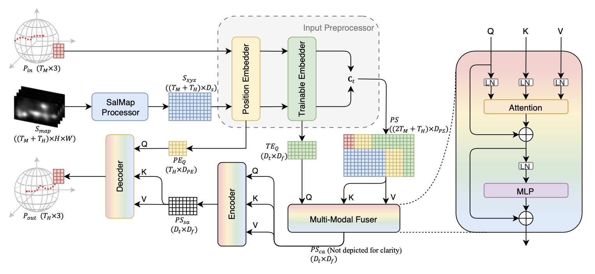
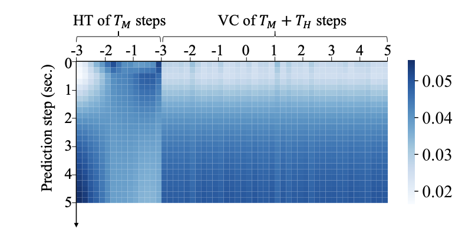
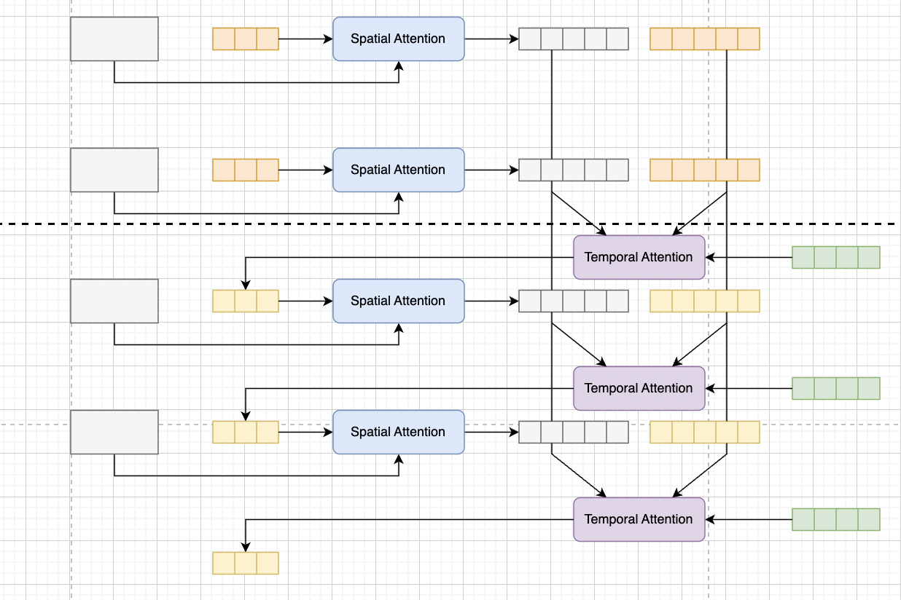
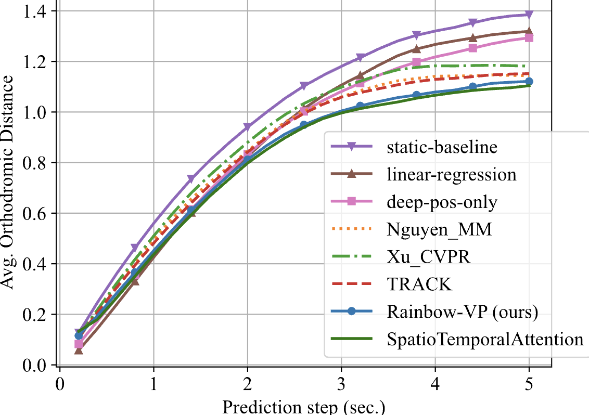

- [[周报]]
	- ## ICME - (ddl: 12/30) - todos
		- ### 模型
			- **完成了对模型结构的大改** (要针对我要解决的具体问题有一些具体的设计)
				- 之前的模型 (==没有针对要解决的两模态 time-varying importance 做具体设计==)
					- {:width 666}
					  collapsed:: true
						- {:width 400,:height 800}
				- 大改之后的模型 (==分别通过 SpatialAttention模块 和 TemporalAttention模块 捕捉 space-varying 和 time-varying importance==)
					- {:width 666}
				- 大改后的模型性能优于之前的模型
					- {:width 666}
			- ~~方法名~~
			  collapsed:: true
				- Multi-level attention mechanism
					- Geoman: Multi-level attention networks for geo-sensory time series prediction.
				- Multi-stage
					- Multistage attention network for multivariate time series prediction
				- Dual-stage
					- A dual-stage attention-based Conv-LSTM network for spatio-temporal correlation and multivariate time series prediction
				-
		- ### 实验
			- datasets
			- competitors
				- Transformer-based
			- evaluation metrics
			- visualize attention matrix
				- spatial
				- temporal
			- 消融实验
			- 图表 (实验部分3图4表)
				- 换不同的横轴
				- 数据分析图 (将数据特征可视化)
		- ### References
			- 增至30篇左右