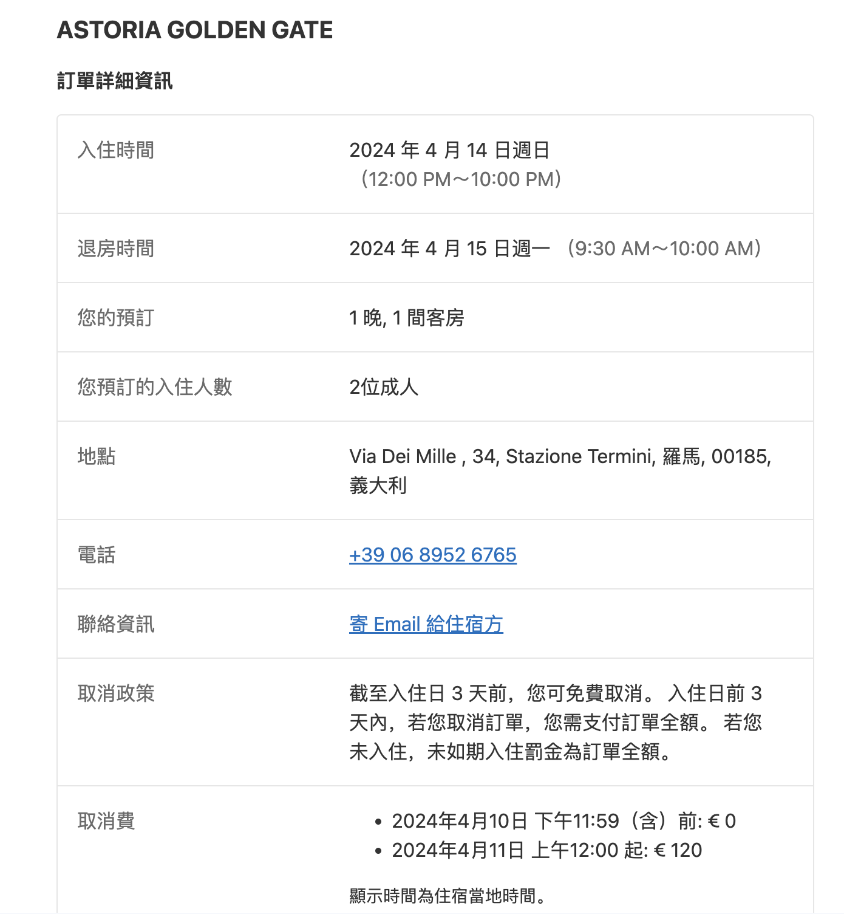

- 4.14
	- 09:00 - 10:30  北邮 --> 北京首都机场T3
	- 13:45 - 18:55  北京首都机场T3 --> 罗马菲乌米奇诺机场3
	- ASTORIA GOLDEN GATE
	  collapsed:: true
		- {:width 400,:height 800}
- 4.15
	- 07:45 - 12:05  罗马特米尼车站 --> 巴里中央车站
	- Red Carpet rooms
	- 13:00 - 14:00  Welcome cocktail at Politecnico di Bari
	- 14:00 - 17:30  开会
	- 19:00 - ???      Welcome Reception at Hotel delle Nazioni rooftop, Bari seafront
- 4.15, 16, 17
	- 09:00 - 12:30  开会
	- 14:00 - 17:30  开会
- 4.18
	- 07:46 - 11:55  巴里中央车站 --> 罗马特米尼车站
	- Hotel Arcangelo
	- 15:30 - ???      梵蒂冈博物馆
- 4.19
- 4.20
- 4.21
	- 20:55 - 12:55  北京首都机场T3 --> 罗马菲乌米奇诺机场3