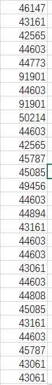
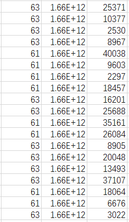
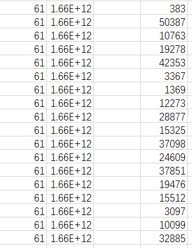
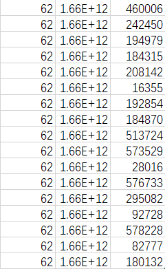
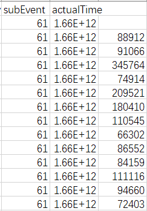

title:: mobile-data/Metrics Analysis

- > 61: 开始播放; 62: 节目播放中; 63: 退出播放
- ### 问题
	- [[#green]]==secondActualTime, 与actualTime一样都是一个13位的时间戳, 所以单位都应该是ms啊? 对于这两者, 文档中只说, 同PERIODIC 的 xxx 字段==
	  collapsed:: true
		- 
	- [[#green]]==关于subEvent(61, 62, 63)的含义, 以及每个上报的数据项到底是对多大的时间窗口的统计==
		- [[#green]]==61播放后1分钟，62是10每分钟，63是播放结束之后的历史播放数据信息。==
		- 通过actualTime对所有数据项排序, 然后看相邻两次上报的时间间隔是多少, 没有发现规律
		  collapsed:: true
			- 
		- 如果61, 62, 63混在一起看不出规律的话, 把它们分开呢? 也没有发现规律. 仔细想想也正常, 因为所有的用户的上报可能都混在一起了
		  collapsed:: true
			- 
			- 
			-
		- 但是将macaddress也固定下来以后, 还是找不出规律
		  collapsed:: true
			- 
	- [[#green]]==m3u8List, tsList, mediaRateList都是一个一个list, 然后其中的每一个元素是一个json数据, 所以用analysis.py无法分析出其中的属性, 所以可能会漏掉一些值;== [[#blue]]==[已修复]==
	- [[#green]]==还有一些和网络相关的指标:==
	  collapsed:: true
		- `mdidfCost`: 本次上报周期内平均网络时延（ms）
			- {'0.00', '1.30'}
		- `maxMdidfCost`: 本次上报周期内网络最大时延（ms）
			- {'12.18', '9.64', '12.16', '0.00', '12.07', '6.06'}
		- `mdidfMean`: 延迟因素，见文档rfc4445
			- {'3.928', '3.882', '3.929', '0.000', '3.806', '3.754', '3.920'}
		- tsPacketCnt: 本次上报周期内收到的总的ts 包个数
			- {'245049', '248213', '245322', '3471083', '3470481', '0', '6696186'}
		- rtpJitter: 本次上报周期内RTP 平均抖动
			- {'0.00', '2.51'}
		- rtpCnt: 本次上报周期内收到RTP 总包数
			- {'35046', '495783', '956598', '0', '35459', '35007', '495869'}
		- maxRtpJitter     {'4.25', '4.28', '4.38', '4.10', '0.00', '4.24', '3.96'}
		- minRtpNoLossTime: [可选]本次上报周期内RTP 最小无丢包的持续时间(单位：毫秒)
			- {'1247019', '46216', '0', '45632', '45689', '646417', '646304'}
		- avgM3u8SessionCost: m3u8 文件请求响应平均延时（单位：毫秒）
			- ... ['345', '60', '377', '358', '295', '5235', '167', '282', '516', '496']
		- maxM3u8SessionCost: m3u8 文件请求响应最大延时（单位：毫秒）
			- ... ['345', '1304', '60', '377', '247', '358', '295', '282', '167', '516']
		- avgTsSessionCost: 媒体文件分片请求响应平均时延（单位：毫秒）
			- ... ['345', '1730', '464', '60', '377', '247', '703', '358', '865', '295']
		- maxTsSessionCost: 媒体文件分片请求响应最大时延（单位：毫秒）
			- ... ['2861', '345', '464', '60', '377', '247', '8875', '6585', '703', '295']
		- avgTcpretran: 本次上报周期内TCP 平均重传率，取值为[0.00，1.00]
			- ... ['0.48', '0.19', '0.41', '0.10', '0.58', '0.34', '0.37', '0.06', '0.43', '0.90']
		- maxTcpretran: 本次上报周期内TCP 最大重传率，取值为 [0.00，1.00]
			- ... ['0.19', '0.43', '0.34', '0.67', '0.18', '0.55', '0.12', '1.00', '0.11', '0.13']
		- m3u8RetranCnt: M3u8 文件请求总的重传包数
			- ... ['209', '60', '247', '14', '27', '172', '192', '7', '38', '64']
		- tsRetranCnt: TS 媒体文件分片请求的总重传包数
			- ... ['9383', '377', '247', '780', '358', '5164', '8278', '863', '660', '17103']
- ### Visual Quality
	- [[#red]]==`mediaRate` : (all) 所请求节目的码率（bps）==
	- `displayResolution` : (partial)上报数据时刻的视频显示分辨率（宽\*高， 如 1200\*720)
		- [[#green]]==displayResolution反而只有两种取值: '1280X720', '1920X1080'==
- ### Video Property
	- `cpAppName` : 播放节目 App 包名
	- `contentIdFromEpg` : (partial)[[#green]]==[必选]== [[#blue]]==[[epg]] 中的内容 id==
	- [[#blue]]==`videoType` : 节目类型，分为直播、点播、回看等==
	- [[#red]]==`resolution` : 节目分辨率（宽\*高，如 1200\*720)==
		- [[#green]]==resolution有超级多种取值, 举一些例子: '960\*540', '1280\*506', '480\*268', '852\*480', '1280\*544', '1074\*720', '1920\*1072', '3840\*2160', '720\*528', '640\*480', 因此感觉这个resolution是视频实际显示出来的分辨率值; 比如有的时候视频是在一个小窗口内显示的.==
	- [[#red]]==`frameRate` : 节目帧率（如 25)==
	- [[#blue]]==`videoCodecType` : 视频编码格式，采集播放器 PLAY_START 事件上报字段 VIDEO_CODEC==
	- [[#blue]]==`audioCodecType` : 音频编码格式，采集播放器 PLAY_START 事件上报字段 AUDIO_CODEC==
- ### Playback Related (这些是我们比较想拿到的)
	- [[#red]]==`mediaRateUpCnt` : 节目码率上升次数== [[#green]]==(指上报周期内还是从播放开始时一直累积)==
	- [[#red]]==`mediaRateDownCnt` : 节目码率下降次数== [[#green]]==(指上报周期内还是从播放开始时一直累积)==
	- [[#red]]==`avgMediaRate` : 节目平均码率(文件大小/播放时长或从播放器获取)==
	- `mediaRate` : 所请求节目的码率（bps）(和Visual Quality那里的mediaRate是一个东西)
	- `stutterAllTime` : 本次观看行为的两次上报时间之间的卡顿 总时长（单位：毫秒），如 61 的上报时间段 为从开始观看节目到上报时间点，63 的上 报时间段为上次最近的上报时间点（可能是 61 或者 62）到本次上报时间点
	- `stutterAllCnt` : 本次观看行为的两次上报时间之间的卡顿总次数 ([[#green]]==这里的stutterAllCnt和stutterAllTime竟然是指两次上报时间之间的统计数据,== 而在 ((81f4877b-92f1-42f2-9c06-dcf4770c4dd5)) 的各种seek指标那里, seekAllCnt和seekAllTime都是指从节目开始播放到上报时间, seekCnt和seekTime才是指两次上报时间之间)
	- `stutterList` : 本次观看行为的两次上报时间之间的满足 minStutterThreshold 的 卡顿真实开始和 结束时间列表,时间同 actualTime。每次卡 顿以分号分割，卡顿开始和结束时间逗号分 割，如“1556643661000，1556643661500； 1556643662000，1556643662500”，对于上 报时候还处于卡顿状态，上报为 “1556643662000，-1556643662500”，对于 上个上报周期卡顿开始和下一个周期卡顿 结 束 的 上 报 为 “ -1556643662500 ， 1556643663000”，如果卡顿跨过整个周期， 上 报 为 “ -1556643662500 ， -1556643663500”
	- `shutterAHistogram` : 卡顿区间直方图，本次观看行为的两次上报 时间之间的卡顿秒数直方图，具体算法见 BOOT 接口的secondsHistogramOfShutter字段，统计本周期内节目的卡顿时长分布
		- > 这里 `shutter` -> `stutter` 应该是有拼写错误
	- [[#green]]==`playTime` : 本次上报周期内节目观看时长（单位：毫秒），本次上报周期内的上报时间段为从节目播放开始到上报时间点，本接口相关字段 同此含义==
	- [[#green]]==`realPlayTime` : 本次观看行为的两次上报时间之间的节目 观看时长（单位：毫秒），如 61 的上报时间 段为从开始观看节目到上报时间点，63 的 上报时间段为上次最近的上报时间点（可能 是 61 或者 62）到本次上报时间点。==
	- `bufferTime` : 节目从开始播放时起缓冲总时长（单位：毫秒）
	- `firstBufferTime` : 首次加载时长（单位：毫秒）
	- [[#red]]==`rebufferFrequency` : 节目从开始播放时起缓冲次数（单位：次）==
		- 注意这里是从节目播放开始一直累积; 或许这就是它和stutterAllCnt的区别? [[#green]]==那么rebuffer和stutter是相同的两个概念吗?==
	- `maxBufferBytes` : 本次上报周期内 缓冲区中字节数的最大值(单位:byte) ([[#green]]==-1是表示无效数据吗?==)
	- `minBufferBytes` : 本次上报周期内 缓冲区中字节数的最小值(单位:byte) ([[#green]]==-1是表示无效数据吗?==)
	- `avgTimeRemain` : 本次上报周期内 播放器剩余可播放时间平 均值(单位:毫秒)
	- `maxTimeRemain` : 本次上报周期内 播放器剩余可播放时间最 大值(单位:毫秒)
	- `minTimeRemain` : 本次上报周期内 播放器剩余可播放时间最 小值(单位:毫秒)
- ### Interactions Related
  id:: 81f4877b-92f1-42f2-9c06-dcf4770c4dd5
	- [[#green]]==这里的seekCnt, seekTime具体是怎么计算的? 对于seekCnt, 用户常常会按多次<-或者->来实现一次seek, 这会被识别为多次seek并加到seekCnt中吗?  还有seekTime是什么? 是用户按住进度条的时间? 是用户最终的时间点距离seek目标时间点的时间?==
	- `seekCnt` : 本次观看行为的两次上报时间之间的 seek 次数，如 61 的上报时间段为从开始观看节 目到上报时间点，63 的上报时间段为上次 最近的上报时间点（可能是 61 或者 62）到 本次上报时间点
	- `seekTime` : 本次观看行为的两次上报时间之间的 seek 时长（单位：毫秒），如 61 的上报时间段为 从开始观看节目到上报时间点，63 的上报 时间段为上次最近的上报时间点（可能是 61 或者 62）到本次上报时间点
	- `seekAllCnt` : 本次观看行为的从节目开始播放到上报时 刻的 seek 总次数
	- `seekAllTime` : 本次观看行为的从节目开始播放到上报时刻的seek 总时长（单位：毫秒）
	- `seekHistogram` : Seek 秒数直方图，具体算法见 BOOT 接口的 secondsHistogramOfSeek 字段，统计本周 期内节目的卡顿时长分布。
- ### Network Related
	- [[#blue]]==`accessMethod` : 网络接入方式(“0”为 wifi, “1”为有线 （dhcp）, “2”为 PPPOE，“3”为 static 或者 manual，”4”为 IPOE，其他还有可能为空“”)== <-- ==wifi的话可能还要考虑frequency==
	- `wirelessSignalStrength` : 无线信号强度(单位微伏db)，有线连接方式值为-9999
	- `linkSpeed`: 无线热点的带宽，有线连接方式值为-1
	- `networkSpeed` : 与路由器协商的有线网口速率，一般为10或者100
	- [[#blue]]==`frequency` : 区分 Wifi 是 2.4G 还是 5G，取值范围：空 （无法采集或者非 Wifi 情况）、2.4G、5G、 其他==
	- `ccErrorCnt` : 本次上报周期内 CC (Continuity Counter Error, 传送流乱序次数)不连续错误数
		- [[#green]]==只有6个数据: {'1777', '914', '67', '73', '65', '855'}==
	- `multicastJoinDelay` : 从发出 IGMP Join 报文到收到第一个组播流 的时间，单位：毫秒
- ### Device Related
	- `deviceResolution` : 上报数据时刻的屏幕显示分辨率（宽\*高， 如 1200\*720)
		- [[#green]]==数据集中没有该项, 搜索resolution也搜不到它==
	- `macadress` : 机顶盒有线 mac 地址
	- `wifimacaddress` : 机顶盒无线 mac 地址
	- `gatewayMac` : 网关 mac，即机顶盒上联设备的 mac 地址（包含家庭智能网关或路由器）
- ### Region Related
	- `area` : 地区编号 (只有一个, 没有分析价值)
	- `brasIp` : [[bras]]的IP编号信息
- ### Ratings
	- `mos` : 本次观看行为的两次上报时间之间的 Mos 值，以逗号分隔，例如 1.2,5,4.0,1.8，根 据 Boot 返回值得时间间隔计算，默认计算 周期为 1 分钟。
	- `sQuality` : 本次观看行为的两次上报时间之间的视频源质量值，上报方式同 mos,与 mos 值一一 对应
	- `sInteraction` : 本次观看行为的两次上报时间之间的交互体验质量值，上报方式同 mos,与 mos 值一 一对应
	- `sView` : 本次观看行为的两次上报时间之间的观看体验质量值，上报方式同 mos,与 mos 值一 一对应
- ### Pipeline
	- **1. 单维指标数据的分析**
		- 视频分辨率的分布
		- 有线接入情况下信号质量的分布范围
		- 卡顿的分布
		- 可以画分布图或者CDF图
		- 实际做的过程中可以对各个指标熟悉一下
		- 多少百分比的用户交互了, 用户交互的次数是怎么分布的
		- 挑几个关键性指标做可视化分析即可
		- 如果是二维的话可以考虑画点的分布
	- **2. 多维指标以及和现有质量指标的相关性分析**
		- 分辨率等和mos值的相关性系数值 (PLCC, KROCC), 交互次数和sInteractions的相关性系数值, 等等
		- 各个指标之间的相关性分析; 如卡顿次数和码率调上调下的次数之间的相关性, 信号质量和播放码率之间的相关性系数, 信号质量和用户交互的次数, 信号质量与卡顿的次数
	- **3. QoE建模分析**
		- 参考ITU/白皮书的标准, 进行更优的建模
		- 自监督, 弱监督模型