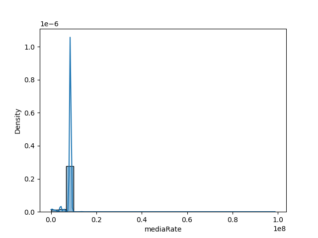
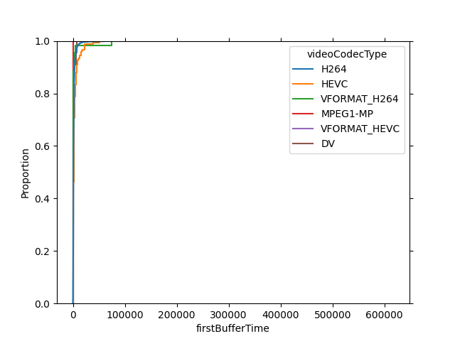
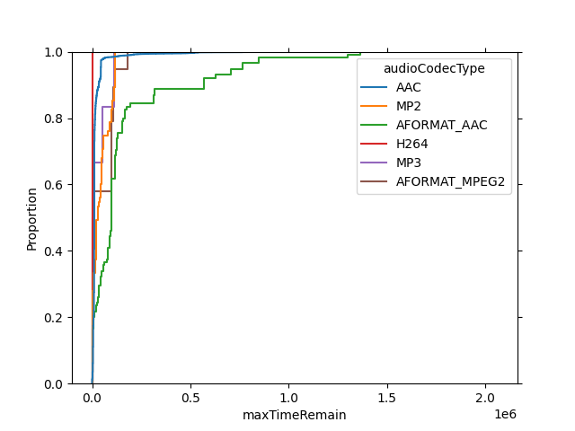
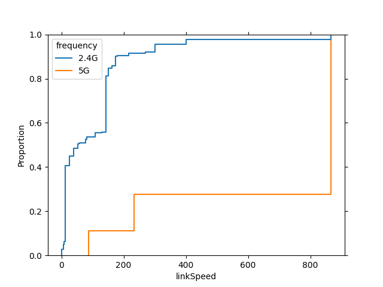
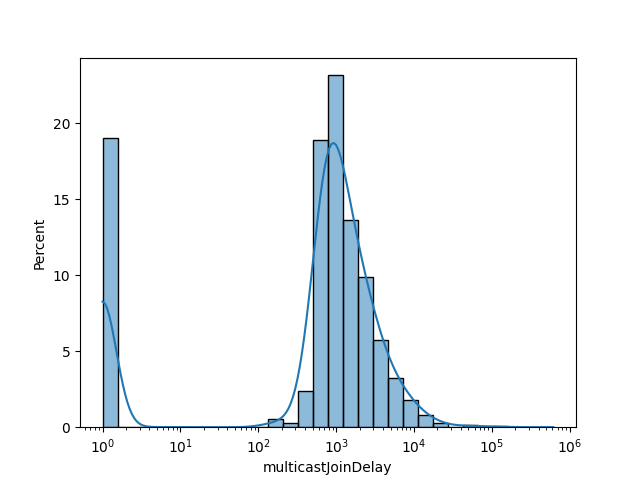
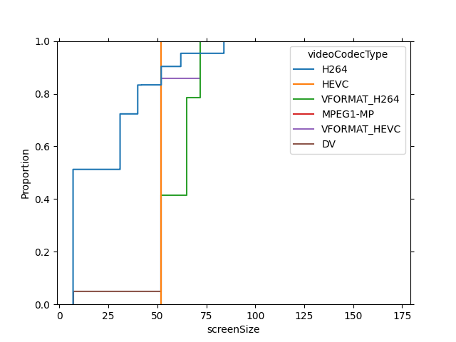

- [[mobile-data/Metrics Analysis]]
- **Notations**
	- (1)表示一家独大的那种数据
	- (实时)表示数据是对两次上传时间的统计数据; (累积)表示从节目开始播放一直累积的数据
- ## single
	- ### content
		- [[#blue]]==**cpAppName** (1)==
		  collapsed:: true
			- **结论**
				- 共有19种取值(太多, 不适合作为分类指标), 每种取值占的比例为: (长度超过10的将只输出前10个) (差距太悬殊, 不适合作为分类指标)
					- [
					      [[$red]]==('tv.icntv.ott', 0.9642741325262134)==,
					      ('com.dianshijia.newlive', 0.012160847475948547),
					      ('com.hisilicon.dlna.dmr', 0.002972651605231867),
					      ('com.cibn.tv', 0.0028105069722192196),
					      ('com.newtv.cboxtv', 0.0028105069722192196),
					      ('com.xiaojie.tv', 0.0025402659171981407),
					      ('com.udte.launcher', 0.0023240730731812777),
					      ('com.youku.taitan.tv', 0.002107880229164415),
					      ('com.ktcp.svideo', 0.002053832018160199),
					      ('com.gitvdemo.video', 0.0018376391741433359)
					  ]
			- **分布图**
			  collapsed:: true
				- 
		- [[#blue]]==**contentIdFromEpg**==
		  collapsed:: true
			- **结论**
				- [[#red]]==这个节目ID的粒度太细了, 如果之后进一步分析转化节目类型数据, 应该会是个很好的指标==
				- 节目很多(177个), 画分布图都把内存跑爆了, 这是不适合用来作为分类讨论的指标的
				- 各种取值的分布比较均匀, 如比例排名前十的数据为:
					- [
					      (1200483484.0, 0.03801652892561983),
					      (893081404.0, 0.01818181818181818),
					      (2752364.0, 0.01818181818181818),
					      (895246952.0, 0.01652892561983471),
					      (894107366.0, 0.01652892561983471),
					      (893081402.0, 0.01652892561983471),
					      (893081409.0, 0.01487603305785124),
					      (894083988.0, 0.01487603305785124),
					      (895246953.0, 0.01487603305785124),
					      (894838726.0, 0.013223140495867768)
					  ]
		- **videoType**
		  collapsed:: true
			- [('直播', 0.7936), ('点播', 0.1472), ('回看', 0.0592)]
			- **分布图**
			  collapsed:: true
				- 
	- ### media
		- [[#blue]]==**mediaRate** (1)== (实时)
		  collapsed:: true
			- **结论**
				- mediaRate的取值跨度很大 (0~98724864) (接近1e8的跨度)
				- 同时发现, [[$red]]==8534016这一个值的占比就高达89.66%==, 且其余任何值的比例都不超过0.4487%. 因此分布图不管怎么画都是一个冲天柱
				  collapsed:: true
					- 具体比例: (从大到小)
						- (8534016, 0.8966057723489352),
						- (4300021, 0.0044860015133499085),
						- (2084544, 0.002648362339206572),
						- (4321000, 0.0015133499081180413),
						- (7729152, 0.001351205275105394),
						- ...
			- **分布图**
			  collapsed:: true
				- **原始分布图**
				  collapsed:: true
					- 
						- 可以看出mediaRate的分布是严重偏斜的, 因此要尝试调整
						  collapsed:: true
							- 最大的二十个值为: [13662208, 13662208, 15634000, 15982592, 15982592, 15986688, 15986688, 15986688, 16843000, 16906000, 19205120, 19205120, 19251200, 19251200, 98724864, 98724864, 98724864, 98724864, 98724864, 98724864]
				- **log_scale=True**
				  collapsed:: true
					- 
				- **缩小横轴范围** (0-0.15 * 1e8)
				  collapsed:: true
					- 原始轴
						- 
					- log轴
						- 
		- **displayResolution**
		  collapsed:: true
			- **结论**
				- [[$red]]==('1920X1080', 0.7816982214572576),==
				- [[$red]]==('1280X720', 0.2183017785427424)==
			- **分布图**
			  collapsed:: true
				- 
		- **resolution** (1) (实时)
		  collapsed:: true
			- **结论**
				- 分布依然很不均衡, 其中 [[$red]]=='1920 * 1080' 占比 96.0166%==, 其次是'1280 * 720', 占比1.52416%, 再之后是 '960 * 540', 占比0.5783%; 剩余的取值占比均低于0.4%
				  collapsed:: true
					- [
					      ('1920*1080', 0.960166468489893),
					      ('1280*720', 0.015241595503188845),
					      ('960*540', 0.005783158577451086),
					      ('720*576', 0.003945519403307751),
					      ('1920*1088', 0.0027564587612150036),
					      ('852*480', 0.002648362339206572),
					      ('480*268', 0.0019457355961517674),
					      ('640*480', 0.001351205275105394),
					      ('896*656', 0.0012971570641011783),
					      ('640*360', 0.0008647713760674522),
					      ('3840*2160', 0.0007566749540590206),
					      ('1920*816', 0.0005945303210463733),
					      ('720*528', 0.0005945303210463733),
					      ('896*664', 0.0004323856880337261),
					      ('1920*804', 0.0003242892660252946),
					      ('720*404', 0.0003242892660252946),
					      ('1280*544', 0.00021619284401686305),
					      ('1920*1072', 0.00010809642200843153),
					      ('896*504', 0.00010809642200843153),
					      ('864*480', 0.00010809642200843153),
					      ('1280*506', 0.00010809642200843153),
					      ('848*480', 0.00010809642200843153),
					      ('720*1280', 0.00010809642200843153),
					      ('1074*720', 0.00010809642200843153)
					  ]
			- **分布图**
			  collapsed:: true
				- 
		- **framerate** (1)
		  collapsed:: true
			- **结论**
				- [[$red]]==(25, 0.9237379742730516)==
				  (30, 0.0449140633445033)
				  (0, 0.029996757107339747)
				  (24, 0.0012431088530969626)
				  (16, 0.00010809642200843153)
			- **分布图**
			  collapsed:: true
				- 
		- **videoCodecType** (1)
		  collapsed:: true
			- [
			      ([[$red]]=='H264', 0.9707504325259516==),
			      ('HEVC', 0.019301470588235295),
			      ('VFORMAT_H264', 0.0061094290657439446),
			      ('DV', 0.002378892733564014),
			      ('VFORMAT_HEVC', 0.0011353806228373703),
			      ('MPEG1-MP', 0.00032439446366782005)
			  ]
			- **分布图**
			  collapsed:: true
				- 
		- **audioCodecType** (1)
		  collapsed:: true
			- [
			      ([[$red]]=='AAC', 0.9880514705882353==),
			      ('AFORMAT_AAC', 0.006217560553633218),
			      ('MP2', 0.0040549307958477505),
			      ('AFORMAT_MPEG2', 0.0010272491349480968),
			      ('H264', 0.00032439446366782005),
			      ('MP3', 0.00032439446366782005)
			  ]
			- **分布图**
			  collapsed:: true
				- 
	- ### playback
		- [[#blue]]==**mediaRateUpCnt**== [[#green]]==(1)== [[#green]]==(累积)==
		  collapsed:: true
			- **结论**
				- 共有3种取值, 每种取值占的比例为: (长度超过10的将只输出前10个)
				  [ [[$red]]==(1, 0.9967030591287428)==, (2, 0.0025943141282023566), (0, 0.0007026267430548049)]
			- **分布图**
				- {:height 488, :width 640}
		- [[#blue]]==**mediaRateDownCnt**== [[#green]]==(1)== [[#green]]==(累积)==
		  collapsed:: true
			- **结论**
				- 共有3种取值, 每种取值占的比例为: (长度超过10的将只输出前10个)
				  [ [[$red]]==(1, 0.9910820451843044)==, (0, 0.006323640687493244), (2, 0.0025943141282023566)]
			- **分布图**
				- 
		- **avgMediaRate** (1) (累积)
		  collapsed:: true
			- **结论**
				- 共有668种取值, 每种取值占的比例为: (长度超过10的将只输出前10个)
				  [
				      (8534016, 0.8966057723489352),
				      (4300021, 0.0044860015133499085),
				      (2084544, 0.002648362339206572),
				      (4321000, 0.0015133499081180413),
				      (7729152, 0.001351205275105394),
				      (77, 0.0011890606420927466),
				      (4300000, 0.0010809642200843152),
				      (4231000, 0.0010269160090800994),
				      (2012536, 0.0009188195870716679),
				      (886232, 0.0008107231650632364)
				  ]
			- **分布图**
				- 
				- 
				- 
				- 
				- 
				- 
				- 
				- 
				- 
				- 
		- **subEvent** (实时)
		  collapsed:: true
			- [(63, 0.4803804994054697), (61, 0.4681115555075127), (62, 0.05150794508701762)]
			- **分布图**
				- 
	- ### stutter
		- [[#blue]]==**stutterAllTime**== [[#green]]==(实时)==
		  collapsed:: true
			- **结论**
			- **分布图**
				- trivial
				  collapsed:: true
					- 
				- 
				- 
				- 
				- 
				- 
				- 
				- 
				- 
				- 
				- 
				-
				-
		- **stutterAllCnt** [[#green]]==(实时)==
		  collapsed:: true
			- **结论**
				- [0, 1, 2]三个值占比0.804237
				- [[$red]]==(2, 0.29607609988109396),==
				  [[$red]]==(0, 0.28910388066155013),==
				  [[$red]]==(1, 0.2190573992000865),==
				  (3, 0.07588368824991892),
				  (4, 0.041238784996216624),
				  (5, 0.02334882715382121),
			- **分布图**
			  collapsed:: true
				- 
				- 
				- 
				- 
				- 
				- 
				- 
				- 
				- 
		- [[#green]]==**stutterList**== (实时)
		  collapsed:: true
			- **结论**
				- stutterAllTime和stutterAllCnt的不足以及stutterList存在的意义
					- 之前的stutterAllTime和stutterAllCnt这两个stutter指标都是对于一个上报时间段内的统计数据, 相当于有一个时间窗口的概念在里头, 这个时间窗口往往会将一次卡顿的时间截断, 我们无法得到每一次卡顿具体持续了多久. 我认为这里的stutterList就是为了获得实际的每个卡顿的持续时间
				- [[#green]]==遇到的问题==
					- stutterList中用负数来表示被时间窗口截断, 但是有的数据的负数处可以连接起来, 但有的连不起来
					- 很多表示一个时间段的数据格式错误; 如: 16,596,809,411,391,600,000,000,000  或许应为: 1659680941139,1600000000000
		- **[[#green]]==shutterAHistogram==** (实时)
		  collapsed:: true
			- **结论**
				- 将这里的分布图和stutterAllTime的作比较, 可以发现有很大不同; [[#green]]==当然这里有个问题就是 [3, 5, 8, 10, 20] 是实际所配置的bin_edges还是说只是举个例子呢==
			- **分布图**
				- 
	- ### buffer
		- **bufferTime** (累积)
		  collapsed:: true
			- **结论**
				- 节目从开始播放时起缓冲总时长（单位：毫秒）
				- bufferTime为0的数据占比20%
			- **分布图**
				- 
				- 
				- 
				- 
				- 
				- 
				- 
				- 
				- 
				- 
				-
		- **firstBufferTime**
		  collapsed:: true
			- **结论**
				- 值为0的数据只占0.3513%
				- 值为[110, 2460]的数据占比82.2722%
				- [[#green]]==为什么高的displayResolution反而firstBufferTime短???==
					- 可能就是因为他网络好, 才给他升为高的displayResolution吧
			- **分布图**
				- 
				- 
				- 
				- 
				- 
				- 
				- 
				- 
				- 
				- 
		- **rebufferFrequency** (累积)
		  collapsed:: true
			- **结论**
				- 节目从开始播放时起缓冲次数（单位：次）
				- 分布在区间[0, 4]的数据占比为0.8200194573559615; 分布在[0, 2]的数据占比为0.64852448383958491
				  collapsed:: true
					- 这里的值整体上确实要比指标 ((633bad44-a114-49d9-a3fc-fdd2ddbeb0ec)) 要大, 因为它是从节目播放开始一直累积的, 而不是在每个上报时间段内的统计值
				- min value: 0
				  max value: 371
				- (2, 0.2575397254350881),
				  (0, 0.20343746621986813),
				  (1, 0.18754729218462868),
				  (4, 0.08653118581774943),
				  (3, 0.08496378769862717),
				  (5, 0.07555939898389363),
				  (6, 0.030429142795373475),
				  (9, 0.018538536374446007),
				  (10, 0.014430872338125608),
			- **分布图**
				- 
				- 
				- 
				- 
				- 
				- 
				- 
				- 
				- 
				- 
			-
		- **maxBufferBytes** (实时)
		  collapsed:: true
			- **结论**
				- 本次上报周期内 缓冲区中字节数的最大值(单位:byte)
				- 光-1这个值就占了73.82%, 0占了2.8483%
				  collapsed:: true
					- [[$red]]==(-1, 0.7382445141065831),==
					  [[$red]]==(0, 0.028483407199221707),==
					      (78848, 0.008107231650632363),
					      (79872, 0.005945303210463734),
					      (75776, 0.00497243541238785),
					      (74752, 0.004918387201383634),
					      (63488, 0.0047562425683709865),
					      (77824, 0.0036752783482866718),
					      (73728, 0.0033509890822613774),
					      (71680, 0.00318884444924873)
				- 去掉-1以后: 0占比10%
				  collapsed:: true
					- (0, 0.1088168490604997),
					      (78848, 0.03097253768325418),
					      (79872, 0.022713194301053067),
					      (75776, 0.018996489779062563),
					      (74752, 0.018790006194507537),
					      (63488, 0.018170555440842454),
					      (77824, 0.014040883749741896),
					      (73728, 0.012801982242411728),
					      (71680, 0.012182531488746646),
					      (72704, 0.008878794135866199)
				- 分布图中, 除了第一张, 其他的图都是将-1这个值去掉以后画的
			- **分布图**
				- 
				- 
				- 
				- 
				- 
				- 
				- 
				- 
				- 
				- 
		- **minBufferBytes** (实时)
		  collapsed:: true
			- **结论**
				- -1一个值就占比73.82%, 0占比14.73%
				  collapsed:: true
					- [
					      (-1, 0.7382445141065831),
					      (0, 0.14733542319749215),
					      (72, 0.006107447843476381),
					      (73, 0.00421576045832883),
					      (10240, 0.003621230137282456),
					      (12288, 0.0035671819262782403),
					      (14336, 0.0032969408712571614),
					      (8192, 0.0032969408712571614),
					      (7168, 0.0030266998162360825),
					      (6144, 0.002864555183223435)
				- 去掉-1以后, 0占比56.29%
				  collapsed:: true
					- [
					      (0, 0.562874251497006),
					      (72, 0.02333264505471815),
					      (73, 0.016105719595292174),
					      (10240, 0.013834400165186868),
					      (12288, 0.01362791658063184),
					      (14336, 0.0125954986578567),
					      (8192, 0.0125954986578567),
					      (7168, 0.011563080735081561),
					      (9216, 0.010943629981416477),
					      (6144, 0.010943629981416477)
				- 以下的分布图都是去除-1后画的
				- 这里的分布图和maxBufferBytes一样, 都会有两个波峰, 还挺有意思的
			- **分布图**
				- 
				- 
				- 
				- 
				- 
				- 
				- 
				- 
				- 
				-
		- **avgTimeRemain** (实时)
		  collapsed:: true
			- **结论**
			- **分布图**
				- 
				- 
				- 
				- 
				- 
				- 
				- 
				- 
				- 
				- 
		- **maxTimeRemain** (实时)
		  collapsed:: true
			- **结论**
			- **分布图**
				- 
				- 
				- 
				- 
				- 
				- 
				- 
				- 
				- 
		- **minTimeRemain** (实时)
		  collapsed:: true
			- **结论**
				- 分布在区间[0, 3000]的数据占比为0.8025078369905956
				  分布在区间[0, 4000]的数据占比为0.8922278672575937
					- [
					      (0, 0.48097502972651607),
					      (1000, 0.1879256296616582),
					      (2000, 0.08977407847800238),
					      (4000, 0.08972003026699817),
					      (5000, 0.05302129499513566),
					      (3000, 0.04383309912441898),
					      (6000, 0.011944654631931683),
					      (8000, 0.008107231650632363),
					      (7000, 0.006593881742514323),
					      (9000, 0.0037293265592908873)
					  ]
			- **分布图**
				- 
				- 
				- 
				- 
				- 
				- 
				- 
				- 
				- 
				- 
				-
	- ### seek
		- **seekCnt** [[#green]]==(1)== (实时)
		  collapsed:: true
			- **结论**
				- min value: 0
				  max value: 31
				  共有12种取值, 每种取值占的比例为: (长度超过10的将只输出前10个)
				  [
				      ([[$red]]==0, 0.9974056858717977==),
				      (1, 0.0010809642200843152),
				      (2, 0.0004323856880337261),
				      (4, 0.0002702410550210788),
				      (3, 0.00021619284401686305),
				      (7, 0.0001621446330126473),
				      (5, 0.0001621446330126473),
				      (6, 5.404821100421576e-05),
				      (31, 5.404821100421576e-05),
				      (24, 5.404821100421576e-05)
				  ]
			- **分布图** (删掉了0)
				- 
		- **seekTime** [[#green]]==(1)== (实时)
		  collapsed:: true
			- **结论**
				- min value: 0
				  max value: 13732
				  共有46种取值, 每种取值占的比例为: (长度超过10的将只输出前10个)
				  [
				      ([[$red]]==0, 0.9974056858717977==),
				      (348, 0.00010809642200843153),
				      (166, 0.00010809642200843153),
				      (24, 0.00010809642200843153),
				      (297, 5.404821100421576e-05),
				      (1075, 5.404821100421576e-05),
				      (574, 5.404821100421576e-05),
				      (144, 5.404821100421576e-05),
				      (22, 5.404821100421576e-05),
				      (660, 5.404821100421576e-05)
				  ]
			- **分布图** (删掉了0)
				- 
		- **seekAllCnt** [[#green]]==(1)== (累积)
		  collapsed:: true
			- **结论**
				- min value: 0
				  max value: 86
				  共有17种取值, 每种取值占的比例为: (长度超过10的将只输出前10个)
				  [
				      ([[$red]]==0, 0.987731056102043==),
				      (1, 0.00853961733866609),
				      (2, 0.0012431088530969626),
				      (3, 0.0005945303210463733),
				      (4, 0.0005945303210463733),
				      (6, 0.00021619284401686305),
				      (8, 0.0001621446330126473),
				      (5, 0.0001621446330126473),
				      (7, 0.0001621446330126473),
				      (86, 0.00010809642200843153)
				  ]
			- **分布图** (删去0)
				- 
		- **seekAllTime** [[#green]]==(1)== (累积)
		  collapsed:: true
			- **结论**
				- min value: 0
				  max value: 31257
				  共有94种取值, 每种取值占的比例为: (长度超过10的将只输出前10个)
				  [
				      ([[$red]]==0, 0.987731056102043==),
				      (55, 0.0007566749540590206),
				      (1678, 0.0003242892660252946),
				      (441, 0.0003242892660252946),
				      (285, 0.0003242892660252946),
				      (1392, 0.0002702410550210788),
				      (1477, 0.00021619284401686305),
				      (166, 0.00021619284401686305),
				      (767, 0.00021619284401686305),
				      (6, 0.00021619284401686305)
				  ]
			- **分布图**
				- 
		- **seekHistogram** (实时)
		  collapsed:: true
			- **结论**
				- [ [[$red]]==97.79614325==  1.10192837  0.55096419  0.          0.27548209  0.27548209]
			- **分布图**
				- 
	- ### network
		- **accessMethod**
		  collapsed:: true
			- [(0.0 (**wifi**), 0.79849737852008), 
			  (1.0 (**有线** （dhcp）), 0.19917842278795742),
			  (4.0 (**IPOE**), 0.0023241986919625966)]
			- **分布图**
				- 
		- **wirelessSignalStrength** (实时)
		  collapsed:: true
			- **结论**
				- 终于画出了比较好看的图!!!
				- 0.8162的数据分布在[-69, -57] (区间长度13)之间; 而当前指标的取值区间为[-96, -10] (区间长度87); 也就是说15%的数据占了80%
				- 该指标在最开始的单位就是微伏dB, 相当于将x轴数据取了log, 这给画图带来了方便
			- **分布图**
				- 
				- 
				- 
				- 
				- 
				- 
				- 
				- 
		- **linkSpeed** (实时)
		  collapsed:: true
			- **结论**
				- min value: -1 (表示有线连接)
				  max value: 867
				  共有39种取值, 每种取值占的比例为: (长度超过10的将只输出前10个)
				  [
				      (72, 0.6023132634309805),
				      (-1, 0.20154577883472058),
				      (150, 0.05561560912333802),
				      (65, 0.05172413793103448),
				      (144, 0.048589341692789965),
				      (13, 0.009080099448708247),
				      (300, 0.007458653118581775),
				      (867, 0.006107447843476381),
				      (108, 0.0016214463301264727),
				      (78, 0.0016214463301264727)
				  ]
				- 去掉-1以后
				  min value: 0
				  max value: 867
				  共有38种取值, 每种取值占的比例为: (长度超过10的将只输出前10个)
				  [
				      (72, 0.754349150477222),
				      (150, 0.06965409869356258),
				      (65, 0.06478034251675353),
				      (144, 0.06085426115210181),
				      (13, 0.011372097745887768),
				      (300, 0.009341366005550666),
				      (867, 0.007649089555269749),
				      (108, 0.0020307317403371015),
				      (78, 0.0020307317403371015),
				      (39, 0.001692276450280918)
				  ]
			- **分布图**
				- 
				- 
				- 
				- 
				- 
				- 
				- 
				- 
		- **networkSpeed** (1) (实时)
		  collapsed:: true
			- **结论**
				- [([[$red]]==100.0, 0.8542742398164085==), (10.0, 0.13539873780837636), (0.0, 0.010327022375215147)]
			- **分布图**
				- 
		- **frequency** (1)
		  collapsed:: true
			- [([[$red]]=='2.4G', 0.9645669291338582==), ('5G', 0.03543307086614173)]
			- **分布图**
				- 
		- ccErrorCnt
		- **multicastJoinDelay** (实时)
		  collapsed:: true
			- **结论**
				- min value: 0
				  max value: 617396
				  共有2900种取值, 每种取值占的比例为: (长度超过10的将只输出前10个)
				  [
				      (0, 0.1903037509458437),
				      (939, 0.0016214463301264727),
				      (825, 0.0015133499081180413),
				      (764, 0.0015133499081180413),
				      (679, 0.0014052534861096098),
				      (660, 0.0014052534861096098),
				      (779, 0.0014052534861096098),
				      (842, 0.001351205275105394),
				      (627, 0.001351205275105394),
				      (723, 0.0012971570641011783)
				  ]
			- **分布图**
				- 
				- 
				- 
				- 
				- 
				- 
				- 
				- 
				- 
				- 
	- ### device
		- **macaddress**
		  collapsed:: true
			- 结论
				- 不适合分类, 共有100种取值, 每种取值占的比例为: (长度超过10的将只输出前10个)
				  [
				      ('fc33e98f9f438a0f7365f229553f04f7', 0.15960436709544915),
				      ('93c04d999b3c9c52ac4f5105203b2f9e', 0.1347421900335099),
				      ('d95217c2b1115f3e6eb73fea310e515b', 0.09712463517457572),
				      ('fda01696ef414db4e66b101f528dca4f', 0.08739595719381689),
				      ('8183e91a0e64322216e4802349c0a95f', 0.06907361366338774),
				      ('93cafff8360ad1483ef95b925f591b7b', 0.044427629445465355),
				      ('8628268411aac6036ac3bea89c66fe79', 0.04026591719814074),
				      ('067541dfafbd635f969f338bd637a3a0', 0.038320181601988974),
				      ('45aaec649bcd3825bd08dd682dccad89', 0.03350989082261377),
				      ('0bbdc9d38d60cdd5cbccaa6b068631ff', 0.031131769538428278)
				  ]
		- **wifimacaddress**
		  collapsed:: true
			- 结论
				- 不适合分类, 和macaddress很像; 感觉只是换了个名字而已. 共有99种取值, 每种取值占的比例为: (长度超过10的将只输出前10个)
				  [
				      ('fe58c0d1d2ad550a0b3751776e90548b', 0.15997616338913268),
				      ('c6889d3bd21baaf8355b7cd57dc2aaec', 0.13505607020965382),
				      ('942144cdfcdede429ba7104849384a96', 0.09735088574679018),
				      ('6da4c30a85d994ad53b635bea53401b6', 0.0875995449374289),
				      ('199eb92991c3838f03344d09489da6d4', 0.06923451974646513),
				      ('915aa9e9d4225880f0cb8c6eeec919ab', 0.044531123029416544),
				      ('4324cfdc76a515f6cd99a8536dfde77c', 0.04035971612763422),
				      ('86033c6a8e9eac4f1f5789117eeb9dbb', 0.038409447965761956),
				      ('63817b96bd5343fe4798c64cd2aeaa9f', 0.033587951676688876),
				      ('2e71128ac1b13143a6d5864f11f93d13', 0.031204290589956118)
				  ]
		- **gatewayMac**
		  collapsed:: true
			- 结论
				- 不适合作为分类指标. 共有107种取值, 每种取值占的比例为: (长度超过10的将只输出前10个)
				  [
				      ('b565006c06e5afca26c60e73e642381d', 0.15960436709544915),
				      ('13a0e6bbf2f3bfb65ac95889da401fea', 0.1347421900335099),
				      ('74be16979710d4c4e7c6647856088456', 0.13193168306129066),
				      ('55459973f36f705c9e0e19d8111e7d91', 0.09712463517457572),
				      ('3ab905ef716b27859c35ffae96553976', 0.06907361366338774),
				      ('72b066fc7e766af2f85f87d3825e3fad', 0.04026591719814074),
				      ('ef42584056ad97bf22cfadc97a5a470d', 0.038320181601988974),
				      ('edf6d487fbc607344d8aec617296b43f', 0.03350989082261377),
				      ('b0695d03ac5f0cb540889b07be24f6ee', 0.031131769538428278),
				      ('ce19c7a18e26e5e2da4f2c70ee21359b', 0.029726516052318668)
				  ]
	- ### region
		- **brasIp**
		  collapsed:: true
			- 结论
				- 不适合做分类; 共有32种取值, 每种取值占的比例为: (长度超过10的将只输出前10个)
				  [
				      ('c56f2358f0806aa8df135519342c3cb0', 0.3522862393254783),
				      ('c48cbeee85e31e8e1d4c629b03b2bb51', 0.15960436709544915),
				      ('1bd7539106ea1f3c8c890d004f438b12', 0.14220084315209167),
				      ('5006789a3c2cc9c9eb6d1f1647b4790b', 0.0980975029726516),
				      ('f3aa9844d1252587b6e65e9818bf2b3f', 0.04042806183115339),
				      ('5137f74a80b0239db6b6442711277e57', 0.0349691925197276),
				      ('a24c2503dc9e7e606023b68715d82a7f', 0.031131769538428278),
				      ('7179479c93c8bedb5ec55f8cafafb380', 0.030050805318343962),
				      ('5acc2573659fed92d061b9246aa0d64e', 0.0198897416495514),
				      ('0aeab3ecf905c6e47e696f6fd6b9ea98', 0.01529564371419306)
				  ]
	- ### [[#blue]]==ratings==
		- **mos** (实时)
		  collapsed:: true
			- **结论**
			  collapsed:: true
				- min value: 1.0
				  max value: 4.7311
				  共有11113种取值, 每种取值占的比例为: (长度超过10的将只输出前10个)
				  [
				      (2.7053, 0.16495758616987008),
				      (2.6142, 0.0948405454740685),
				      (4.5526, 0.06509717599055084),
				      (2.7232, 0.03932674755717814),
				      (2.7909, 0.027112638247610867),
				      (4.1678, 0.024132932460002147),
				      (2.6209, 0.015891764200579833),
				      (2.6592, 0.01154300440244819),
				      (2.7243, 0.011220874047031032),
				      (4.7311, 0.009583378073660475)
				  ]
			- **分布图**
				- 
		- **screenSize** (实时)
		  collapsed:: true
			- **结论**
				- 共有11种取值, 每种取值占的比例为: (长度超过10的将只输出前10个)
				  [
				      (7.0, 0.49794238683127573),
				      (31.0, 0.20456104252400548),
				      (40.0, 0.10699588477366255),
				      (52.0, 0.08847736625514403),
				      (62.0, 0.04835390946502058),
				      (84.0, 0.0450960219478738),
				      (65.0, 0.004458161865569273),
				      (72.0, 0.002914951989026063),
				      (42.0, 0.0006858710562414266),
				      (37.0, 0.0003429355281207133)
				  ]
			- **分布图**
				- 
				- 
				- 
				- 
				- 
				- 
				- 
				- 
				- 
				-
		- **sQuality** (实时)
		  collapsed:: true
			- **结论**
				- min value: 1.0
				  max value: 4.7553
				  共有56种取值, 每种取值占的比例为: (长度超过10的将只输出前10个)
				  [
				      (4.5526, 0.4485128315258241),
				      (4.3628, 0.14133469343927843),
				      (4.7311, 0.12262428862879846),
				      (4.5901, 0.07218404380972834),
				      (4.1678, 0.03003865564265006),
				      (4.4566, 0.027595833780736604),
				      (4.3768, 0.025126167722538388),
				      (4.5923, 0.022951787823472566),
				      (4.5516, 0.02198539675722109),
				      (4.2951, 0.018871469988188554)
				  ]
			- **分布图**
				- 
		- **sInteraction** (实时)
		  collapsed:: true
			- **结论**
				- min value: 1.0
				  max value: 5.0
				  共有3049种取值, 每种取值占的比例为: (长度超过10的将只输出前10个)
				  [
				      (1.0, 0.06609041125308708),
				      (5.0, 0.018629872221625685),
				      (2.5344, 0.0036508106947278),
				      (4.2505, 0.0032481477504563514),
				      (4.6012, 0.0032481477504563514),
				      (3.6966, 0.003194459357886825),
				      (2.978, 0.0028991731987544293),
				      (4.6704, 0.00281864060990014),
				      (3.778, 0.00281864060990014),
				      (2.8428, 0.002764952217330613)
				  ]
			- **分布图**
				- 
		- **sView** (实时)
		  collapsed:: true
			- **结论**
				- min value: 1.0
				  max value: 5.0
				  共有9389种取值, 每种取值占的比例为: (长度超过10的将只输出前10个)
				  [
				      (1.0, 0.46308923010845054),
				      (5.0, 0.20887469129174271),
				      (3.3706, 0.00018790937399334264),
				      (2.9127, 0.0001610651777085794),
				      (2.9439, 0.0001610651777085794),
				      (2.8725, 0.00013422098142381618),
				      (3.6686, 0.00013422098142381618),
				      (2.9622, 0.00013422098142381618),
				      (2.8193, 0.00013422098142381618),
				      (2.9445, 0.00013422098142381618)
				  ]
			- **分布图**
				- 
	- ### time
	-
- ## multiple
	- ### 各指标之间
		- **mediaRate**
			- playback
				- mediaRateUpCnt
				- mediaRateDownCnt
				- avgMediaRate
			- stutter
			- buffer
				- bufferTime
				- maxBufferBytes
				- minBufferBytes
				- avgTimeRemain
				- maxTimeRemain
				- minTimeRemain
			- seek
			- network
				- wirelessSignalStrength
				- linkSpeed
				- networkSpeed
				- multicastJoinDelay
			- rating
	- ### 各指标与ratings指标之间