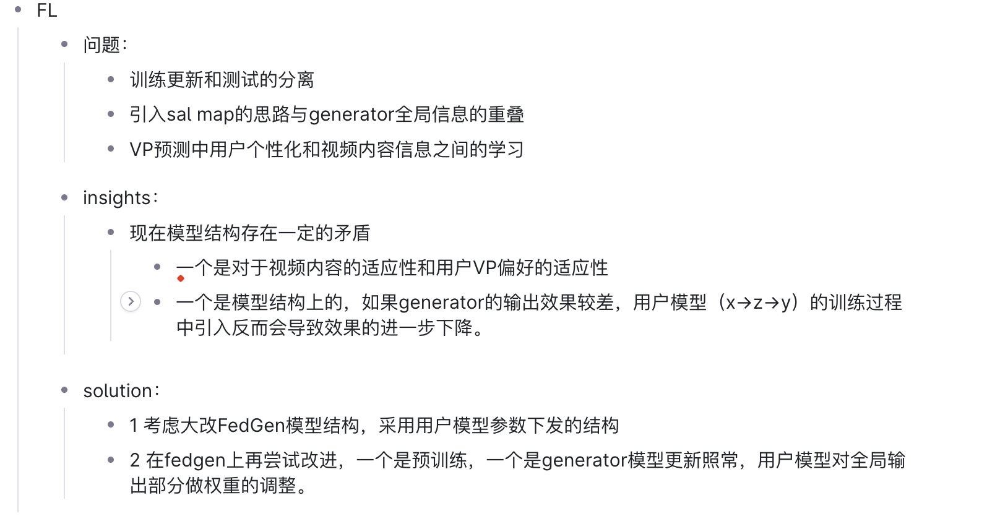

- 
- ## 思路timeline整理
	- FedGen框架中的Generator_model在训练时, 需要得到groud truth label的分布; 在我们的VP预测问题中, label的分布实际上就是视点的分布; 而视点的分布是根据视频内容不断变化的 (salmap就是一个很好的说明), 如果Generator_model提供给user_model的是一个面向==所有用户==和==所有视频内容==的最全局最全局的信息, 那么这个信息非但不会提升user_model的性能, 甚至可能会给user_model错误的引导. ==user_model希望得到的, 不是面向 "所有视频内容、所有用户" 的全局信息, 而是针对 "当前特定视频内容的、所有用户的" 全局信息.== 那怎么才能使Generator_model提供的全局信息, 是考虑了 "特定视频内容的" 全局用户视点信息呢?
	- ==我想到**可以将salmap作为Generator_model的输入之一.** 如此一来, Generator_model就有了对视频内容的针对性.==
	- **该方案的核心立足点为:**
		- 轻量
			- VP模型只以用户的历史视点轨迹为输入. 在训练和预测时更加轻量, 缓解了客户端在online training时的计算负担.
		- 隐私保护
			- FedGen框架是一种联邦学习框架的变体.
		- 在轻量和隐私保护的前提下, 尽可能提高模型的预测性能.
	- **但该方案存在以下问题:**
		- Generator_model是通过什么方式, 向user_model提供全局信息的? 不是通过生成一个全局的特征向量作为user_model的输入! Generator只能在user_model的训练过程中将针对具体视频内容的全局信息给到user_model! 所以该方案下, 我们的整个框架不能为"离线训练, 在线微调", 而**==必须为online training==**. online training的话就又有个问题了: CoLive那篇论文中引用道: "在线学习需要额外的计算开销，这可能会超出能力有限的观看者的设备[13]。" 所以CoLive提出在Edge端做user_models的在线训练. 那么FedGen框架中能不能也在Edge端做user_models的在线训练呢? 不可以! 因为FedGen本身就是一个联邦学习框架, 以用户不上传自己的本地数据集为前提.
		- 就算假设客户端的算力足够, 可以在客户端online training, 那我的方案, 真的能比 "将salmap作为VP模型输入之一, 对VP模型进行离线训练" 的效果好吗? 不一定! 这是因为Generator_model传递给VP模型的所谓=="针对特定视频内容的全局用户信息"是有滞后性的==; 就是说, VP模型针对用户刚看的一段视频内容完成训练以后, 真正去做预测时又会面对不同的视频内容; 虽然两个视频内容在时间上挨得比较近, 会有一定的相似性, 但是感觉还是不如直接将salmap作为模型输入. 而且都假设客户端有足够的算力做在线训练了, 那么该思路的核心立足点: 轻量性, 也就站不住脚了. 一个既不轻量, 性能又不好的框架思路, 不就是依托答辩.
		- 在线学习的话, ==训练集与测试集的划分也是个问题==. 因为Generator是在训练VP模型时将与当前视频内容有关的全局知识给到VP模型的, 所以训练出的VP模型是只针对当前视频内容的, 因此, 我们的dataloader不能shuffle, 而且应该使用当前train_batch的下一个batch作为test_batch, 才比较符合实际的在线训练场景, 也更能说明我们模型的性能. 但是这种测试性能的方式真的能被认可吗? ==还需要再做些调研 (coLive等).==